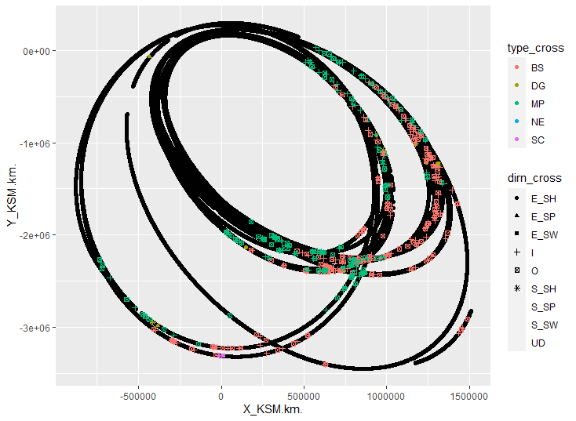

---
output:
  pdf_document:
    number_sections: yes
    fig_caption: yes
  html_document:
    df_print: paged
geometry: left=3.8cm,right=2.5cm,top=2.5cm,bottom=2.5cm
papersize: a4
header-includes: \usepackage{amsmath} \usepackage{pdflscape} \usepackage{caption}
  \usepackage{leading} \usepackage{setspace}
bibliography: bibliography.bib
---
\onehalfspacing

\newpage                  <!-- new page -->
\thispagestyle{empty}

```{r, include=TRUE, echo=FALSE, message=FALSE, warning=FALSE, fig.pos="h!", fig.align="center", out.height="25%"}
  
```

\begin{center}          % <!-- center text -->

\bigskip                % <!-- blank lines -->
\bigskip

\Large
\textbf{DATA SCIENCE AND ANALYTICS DISSERTATION}

\bigskip                % <!-- blank lines -->
\bigskip

\textbf{Classification of bow shock and magnetopause event positions by using the Magnetic Field properties of Saturn} % <!-- make large text -->

\bigskip                % <!-- blank lines -->
\bigskip

\Large{A thesis submitted in fulfillment of the requirement for the \\
degree of M.Sc. in Data Science and Analytics.}

\bigskip                % <!-- blank lines -->
\bigskip

\large{Author:}
\large{Mathews Philip Venattu (20250487)}

\large{Supervisor:}
\large{Dr. Katarina Domijan}

\bigskip                % <!-- blank lines -->
\bigskip

\large{Department of Mathematics and Statistics\\
University: National University of Ireland, Maynooth.\\
Date Submitted: 10th July, 2021}

\end{center}              <!-- end center -->

\newpage 

\thispagestyle{empty}

\begin{center}

\large{Abstract}

\end{center}

\bigskip


Cassini-Huygens Space Research mission was a joint collaboration of NASA, ESA and Italian Space agency to study about the planet Saturn and its system that includes its Rings and Natural Satellites. During its life span of about 20 years the spacecraft orbited the planet Saturn for 13 years and also frequently changed its shape and tilt. Because of this frequent changes in the orbital trajectory of spacecraft, it passed multiple times through the boundaries of Bowshock and Magnetopause at different latitude, longitude and phases of Solar Cycle. In this Project, based on the Magnetic Field data collected during the year 2005 from MAG (Magnetometer) instrument attached to the spacecraft was used to Classify the different boundary crossings of CASSINI  Spacecraft. MAG (Magnetometer)in Cassini recorded the strength and direction of the Magnetic field around the spacecraft. Different Statistical models were used for the classification and those models were carefully examined to get more insights about magnetic field properties during different events. In this project, different trial and error approaches were taken to create a training dataset that gives better test accuracy on test dataset.  


\newpage 
\thispagestyle{empty}
\tableofcontents

\newpage
\pagenumbering{arabic}
# List of tables{-}
\renewcommand{\listtablename}{} <!-- removes default section name -->
\listoftables

\newpage
# List of figures{-}
\renewcommand{\listfigurename}{}
\listoffigures

\newpage

# Introduction{#intro}

All planets in our solar system have magnetic field like earth. Some of the planets like Uranus, Saturn, Jupiter, and Neptune has large magnetic field than earth. Magnetosphere of an astronomical object is the area surrounding that object where its Magnetic field is present. Like all other planets Saturn also has the similar magnetosphere structure - it has a Bow shock, Magneto sheath, Magneto pause and Magneto tail. Among this structure bow shock is the point at which the Magnetosphere of the Saturn interacts with the solar wind that in turn suddenly reduces its speed and pressure. Magneto pause is the boundary between Saturn’s Magnetic field and Solar wind. The magneto sheath exists between the bow shock and the magneto pause, an area of shocked solar wind that is significantly influenced by the changes that occur within the bow shock and whose features can impact the interaction across the magneto pause. The dynamic pressure of Solar wind usually determines boundary and position of Magneto pause and Bow shock [2]. The Cassini Huygens Mission is a joint NASA/ESA/ASI project to make a detailed survey of the ringed planet Saturn and its natural satellites. Cassini spacecraft recorded magnetic field and plasma condition of the environment during its insertion to Saturn’s orbit by using the Cassini Magnetometer (MAG), Plasma Spectrometer (CAPS). The magnetic field strength pattern clearly shows some “overshoot” and “foot” when the spacecraft passed through the boundaries of Magnetopause, Bow shock and Magneto sheath [3]. The Magnetometer (MAG) which continuously acquired magnetic field data that is associated with the Plasma Environment and internal source of Saturn are essential to study about the interaction between solar wind and Magnetosphere of Saturn.

\bigskip                 <!-- blank lines -->
\bigskip


\bigskip                 <!-- blank lines -->
\bigskip

Magnetosphere of Saturn act as an obstacle to the Solar wind far away from the planet and the magnetopause of the planet Saturn lies in 20 Rs (Radius of Saturn=60330 km). So, the Solar wind which interact with the magnetosphere is decelerated by the bow shock and the physical properties of the plasma (@sergis2013). The magneto disk pressure, which inflates the equatorial magnetosphere considerably more than the high-latitude magnetosphere, affects the geometry of the magnetopause boundary itself, resulting in clear polar flattening [5]. In the case of Earth, basic pressure balance is due to the interaction between upstream solar wind flow against magnetic pressure from the magnetosphere and this helps to draw the approximate location of magnetopause boundary but when it comes to Saturn we must consider the influence of the natural satellite Enceladus, which serves as a huge internal plasma source. The pressure related with the super thermal component of this internally produced plasma serves to inflate the magnetosphere considerably beyond what a basic magnetic pressure calculation would predict [6]. So even in a steady solar wind conditions, Due to the internal plasma mentioned above the magneto pause boundary of Saturn may move significantly. 

Lots of studies were done based on the data acquired from the Cassini Spacecraft instruments. (@sergis2013) they chose intervals between 2004 and 2011 when the spacecraft was travelling through the magnetic sheath and used the data recorded to explore different properties like plasma, energetic particle, magnetic field density, temperature etc. They concentrated more on the presence of W+s ions (water group) and explained the ejection of energetic ions as a function of pitch angle and energy which shows the often flow of heavy energetic ions from bow shock. Analysis of CAPS (Cassini Plasma Spectrometer) by Burkholder et. al [8] shown the significant ion flow differences prenoon and post noon, and apart from the magnetic field data was used to illustrate the rotation of IMF (Inter Planetary Magnetic Field) vector.

Based on literature survey, I got information regarding the different variables in the dataset like Magnetic field, direction of cross, position of the spacecraft etc. In this project we are only considering the bow shock and magnetopause crossing of the spacecraft during the year 2005. This report explains about the entire project with different sections like Background, Dataset explanation,	Data Manipulation, Data Visualization, Models trained to classify the type of crossings, R code used, summary of the results and conclusion. Background section explains about the different terms used and current approaches done by others for classification. In Dataset explanation section it explains about each variable and the different datasets that were used for this project. Data Manipulation section gives a detailed explanation about the transformations and imputations done on the dataset. New dataset made after data manipulation is explained visually on the data visualization section. There are different models tried to achieve better results each model that are used for this project is explained on this part of the report. Remaining portions explains about the code and its results.


\newpage

# Background

In the early days, Scientists have very less information regarding the Planet Saturn and its magnetosphere because as we all know that the magnetic fields are invisible, and it needs to be studied from inside. Cassini Huygens mission was a great opportunity for the science world to explore the planet and its behaviour. This mission helped to study the magnetic field and the flow of different gases under the influence of the magnetic field which affects the auroras of Saturn. This mission given some powerful insights about the atmosphere and the surrounding of Planet Saturn. By comparing Saturn with the similar exoplanets will give information regarding the evolution of the Solar System. Different studies were done based on the data gathered from the Cassini spacecraft. Based on this data [9] demonstrated that polar flattening of the magnetopause causes shorter streamline pathways over the poles, resulting in a higher-pressure gradient, which twists the field. This in turn leads to different conditions at the magnetopause when compared to those predicated based on axisymmetric assumptions. From 2004 day 299 through 2012 day 151, a substantial data was compiled by [10] of magneto sheath measurements was collected using data from CAPS, MAG, and MIMI. This data collection enables researchers to investigate things like local temporal dependence of magneto sheath parameters. They also demonstrated a new method for estimating upstream solar wind speed using the same	 magneto sheath parameters. [11] used the MAG data for research which provides a broad picture of low-frequency waves in Saturn's magnetosphere, which has crucial consequences for how magnetospheric energy leaks.

Both the Bow shock and magneto pause models can be used as a significant tool which gives insights about the solar upstream conditions and its dynamic pressure at which they are associated. All the data associated with Cassini uses KSM coordinate system and this system is Saturn centred where the x -axis is towards the sun [13]. Orbital tour of Cassini around Saturn which started in the month of July 2004 during that time the spacecraft crossed 100 Bow Shock boundaries. A study done by [12] On 11th and 12th of April 2005, Cassini magnetometer readings were made during a typical sequence of Cassini bow shock crossings. The spacecraft began and finished the period downstream of the shock in the magneto sheath solar wind, with two trips into the upstream solar wind, each separated by two shock crossings. The presence of obvious shock ramps and a constant upstream field indicates that these are quasi-perpendicular crossings. During this time magnetic field strength values recorded by the magnetometer were so high. In this report I analysed the magnetometer and position data of Cassini spacecraft during the year 2005 to classify the Magnetopause and Bow Shock events.


\newpage

# Datasets

Cassini Spacecraft orbited around the Saturn for about 9 years.During this period the spacecraft transmitted valuable information regarding Saturn  like the magnetic field strength, position at which it was measured to earth. Magnetometer and CAPS are the main instruments that were used for measuring the magnetic field strength and Kinetic Energy of particles at each point. For this project, I am only considering the data that was recorded during the year 2005 by the spacecraft. Mainly two datasets were used in this project to make a final combined useful dataset, first dataset contains a list of Bow Shock and Magneto pause event crossings that occurred during the year 2005 (Jackman et. al,2019). The second dataset contains the information regarding the position of spacecraft and the vector data of Magnetic field strength. 

## Raw Datasets 

### Dataset 1: Magnetopause And Bowshock Crossing List 

This dataset only contains the data of the year 2005 and that was originally developed by compiling two datasets that are posted in the MAPSView webpage (http://mapskp.cesr.fr/BSMP/index.php) which contains the Bow Shock and Magnetopause event crossings between 2004 day 179 and 2007 day 349 (H.J. McAndrews, S.J. Kanani, A. Masters, and J.C. Cutler) through visual identification of CAPS and MAG data. The second list of data has the magnetopause crossings during the year 2004 to October 2010 and May 2012 to February 2013 [6]. 

This dataset contains seven variables: `year_cross`, `doy_cross`, `doyfrac_cross`, `hour_cross`, `minute_cross`, `type_cross`, `dirn_cross`, `xcrosslist`, `ycrosslist`, `zcrosslist`

  
```{r, echo=FALSE, message=FALSE , warning=FALSE}
suppressMessages(library(ggplot2))
suppressMessages(library(cowplot))
suppressMessages(library(plotly))
suppressMessages(library(dplyr))
suppressMessages(library(tidyverse))
suppressMessages(library(mgcv))
WD <- getwd()
if (!is.null(WD)) setwd(WD)
raw_data_1<-readRDS('./Data/dataset_version_0/Full_Cassini_Master_MP_BS_CMJ_revised2005.rds', refhook = NULL)
glimpse(raw_data_1)
```
<b><u>Variable Description</u></b>

* `year_cross`: It contains a numeric value of the year in which spacecraft crossed the event.
* `doy_cross `: It contains a numeric value of the day on which spacecraft crossed the event.
* `hour_cross`: It contains a numeric value of the hour at which spacecraft crossed the event.
* ‘minute_cross `: It contains a numeric value of the minute at which spacecraft crossed the event.
*	`doyfrac_cross`:  `doy_cross` + (`hour_cross`*60+`minute_cross`)/(24*60) 
*	`type_cross`: This is a categorical variable contains information about what type of event did the spacecraft crossed. 
    +	**MP**: Magnetopause
    +	**BS**: Bow Shock
    +	**DG**: Data gap
    +	**SC**: SCAS interval which are unreliable data
*	`dirn_cross`:  This is also a Categorical variable that contains information regarding in which direction did the spacecraft moved.The direction categories in this variable are:
    +	**in**: Inbound means the spacecraft is moving towards the planet.
    +	**out**: Outbound means the spacecraft is moving away from the plant.
    +	**S_SW**: Starts with the solar wind is the region at which spacecraft recorded values at the start of solar wind.
    +	**S_SH**: Starts with Magneto sheath is the region at which spacecraft recorded values at the start of magneto sheath.
    +	**S_SP**: Starts with Magnetosphere is the region at which spacecraft recorded values at the start of magnetosphere.
    +	**E_SW**: Ends with the solar wind is the region at which spacecraft recorded values at the end of solar wind.
    +	**E_SH**: Ends with Magneto sheath is the region at which spacecraft recorded values at end start of magneto sheath.
    +	**E_SP**: Ends with Magnetosphere is the region at which spacecraft recorded values at the end of magnetosphere.
  
For an inbound the first event that will occur is a Bow Shock and later followed by Magnetopause. But in the case of an outbound direction the first event that occur will be a Magnetopause and later followed by a Bow Shock. Region of sampling at the start of any data gap will have a S_SW, S_SH and S_SP direction type and Region of sampling at the end of data gap E_SW, E_SH and E_SP. Dimension of this dataset is (480,10).

### Dataset 2: Magnetometer Dataset

In this dataset it contains the magnetometer data of Cassini Spacecraft during the year 2005.
Time difference between each Data points is one minute which means each data point represents the data of a particular minute. The data in this dataset are provided in the KSM (Kronocentric Solar Magnetospheric) Coordinate system which is a kind of Saturn centred Coordinate system where direction of X is from Saturn to the Sun	and X-Z plane of the Coordinate system contains the Saturn centred axis of Magnetic Dipole ‘M’. 

  
```{r, echo=FALSE, message=FALSE , warning=FALSE}

raw_data_2<-readRDS('./Data/dataset_version_0/Cass_data2005.rds', refhook = NULL)
glimpse(raw_data_2)
```

Some of the relevant variables in the dataset are:

* `X_KSM.km.`: This is the X coordinate point value  of the spacecraft in KSM Coordinate System.
*	`Y_KSM.km.`:  This is the Y coordinate point value of the spacecraft in KSM Coordinate System.
*	`Z_KSM.km.`: This is the Z coordinate point value of the spacecraft in KSM Coordinate System.
*	`Timestamp.UTC.` : It is the timestamp  at which data point was recorded by the Magnetometer.
*	`DOY.UTC.` : It tells about the day at which the datapoint was recorded in the year 2005.
*	`BX_KSM.nT.`: It is the x component of magnetic field strength in Amperes/meter.
*	`BY_KSM.nT.`: It is the y component of magnetic field strength in Amperes/meter.
*	`BZ_KSM.nT.`: It is the z component of magnetic field strength in Amperes/meter.
*	` BTotal.nT.` : It is the resultant vector of Bx, By and Bz

\begin{equation}
 	B_{Tot} = \sqrt{Bx^2 + By^2 + Bz^2}
\end{equation}

This dataset contains 494683 rows and 12 columns.

 
## Derived Datasets

This section contains the information regarding all the datasets that were derived from the Raw Datasets.

### Dataset 3: Combined Data Of Dataset 1 And Dataset 2

This is a newly created dataset by merging dataset 1 and dataset 2 So, that we can understand the Magnetic field properties during the events like Magnetopause and Bow Shock.  For merging the two datasets I used date and time as the key. To format the date in Dataset 1 I used the `doy_cross` variable in each row adding to “2004-12-31” date. By doing so it will generate a date with respect to the reference date.  In dataset 2 the variable `Timestamp.UTC.` is in string format inorder to convert it into a data format I used `as.POSIXct()` function with `format="%d/%m/%Y %H:%M"`. Later I have converted the ` Timestamp.UTC.` variable into a new format and which is then stored in the `date` variable. Two new variables are also created in the Dataset 2 known as `hour_cross` and `minute_cross`. `left_join()` function was used for merging the two datasets by using the variables `date`,`hour_cross` and `minute_cross` which is common on dataset 1 and dataset 2. In the newly created dataset it contains all the variables of dataset 1 and dataset 2. The dimesnsion of the newly created dataset is 494683 rows and 19 columns. Some of the variables are removed from the dataset because we know that dataset 1 has very less number of datapoints when compared to dataset 2 So, it is better remove the variables like `xcrosslist`, `ycrosslist`, `zcrosslist`, `year_cross`, `doy_cross`,`SCET.s.`, `doyfrac_cross`, `hour_cross` and `minute_cross` from the merged dataset. Data manipulations and Visualizations were done on this newly created dataset.

  
```{r, echo=FALSE, message=FALSE , warning=FALSE}
raw_data_3<-readRDS('./Data/dataset_version_0/joined_data.rds', refhook = NULL)
raw_data_4<-readRDS('./Data/dataset_version_2/input_datasetFinal.rds', refhook = NULL)
raw_data_5<-readRDS('./Data/dataset_version_2/Average_SD_Data.rds', refhook = NULL)
glimpse(raw_data_3%>%select(-c(xcrosslist,zcrosslist,ycrosslist,year_cross,doy_cross,doyfrac_cross,hour_cross,minute_cross,'SCET.s.')))
```
 After removing some of the variables, now the modified dataset hass 494683 rows and 16 columns.
 
### Dataset 4: Average and Standard Deviation Dataset

This dataset was created after the exploratory  data analysis done on `Dataset 3`. From the results of those analysis Standard deviation and Average value of the Total Magnetic field 15 minutes before and 15 minutes after of an event occurred data point are showing some pattern. 

```{r, echo=FALSE, message=FALSE , warning=FALSE}
glimpse(raw_data_5)
```
**Some of the Variables are**

* `Avg_Lag_Bx.`: This is the Average of all the `Bx` values that were recorded 15 minutes before each datapoint.
*	`Avg_Lag_By`:  This is the Average of all the `By` values that were recorded 15 minutes before each datapoint.
*	`Avg_Lag_Bz`:  This is the Average of all the `Bz` values that were recorded 15 minutes before each datapoint.
*	`Avg_Lag_BTot`: This is the Average of all the `BTot` values that were recorded 15 minutes before each datapoint .
*	`SD_Lag_Bx.` : This is the Standard Deviation of all the `Bx` values that were recorded 15 minutes before each datapoint.
*	`SD_Lag_By` :This is the Standard Deviation of all the `By` values that were recorded 15 minutes before each datapoint.
*	`SD_Lag_Bz`: This is the Standard Deviation of all the `Bz` values that were recorded 15 minutes before each datapoint.
*	`SD_Lag_BTot.`: This is the Standard Deviation of all the `BTot` values that were recorded 15 minutes before each datapoint.
* `Avg_Lead_Bx.`: This is the Average of all the `Bx` values that were recorded 15 minutes after each datapoint.
*	`Avg_Lead_By`:  This is the Average of all the `By` values that were recorded 15 minutes after each datapoint.
*	`Avg_Lead_Bz`:  This is the Average of all the `Bz` values that were recorded 15 minutes after each datapoint.
*	`Avg_Lead_BTot`: This is the Average of all the `BTot` values that were recorded 15 minutes after each datapoint.
*	`SD_Lead_Bx.` : This is the Standard Deviation of all the `Bx` values that were recorded 15 minutes after each datapoint.
*	`SD_Lead_By` :This is the Standard Deviation of all the `By` values that were recorded 15 minutes after each datapoint.
*	`SD_Lead_Bz`: This is the Standard Deviation of all the `Bz` values that were recorded 15 minutes after each datapoint.
*	`SD_Lead_BTot.`: This is the Standard Deviation of all the `BTot` values that were recorded 15 minutes after each datapoint.
 
\newpage

# Data Manipulation Section

In this section will explain about the data manipulation that was done on the merged dataset (dataset 3). There were lots of NA values in different predictors, so it is important to impute these values before using it for training the models.

```{r, echo=FALSE, message=FALSE ,results='hide'}

suppressMessages(library(ggplot2))
suppressMessages(library(cowplot))
suppressMessages(library(plotly))
suppressMessages(library(dplyr))
suppressMessages(library(tidyverse))
suppressMessages(library(mgcv))
suppressMessages(library(caret))

WD <- getwd()
if (!is.null(WD)) setwd(WD)

```


## Removing Time Dependency

Since all the datapoints were recorded by the spacecraft using the instruments over time so, there can be a time dependency. To remove the time dependency, I made the dataset wider which means a thirty-minute window was used for each data point and stored the magnetic field strength values and position of the spacecraft at each minute as a column for each row. Now for each data point there are 219 columns. I have labelled each column in the format (predictor_name{minute_index}) For example, the BX_KSM16 represents the BX_KSM value after one minute of the selected datapoint. Since all time-dependency variables need to be removed So, in this dataset the variable Timestamp.UTC. ` was removed for this purpose. 

## Data Imputation

In this dataset there are many NA values in different predictors like `type_cross` and `dirn_cross`. Since `type _cross` and `dirn_cross` are both categorical variables So, it is critical to impute the NA values with relevant short terms. `type_cross` variables represents the type of event at which the spacecraft crossed. Currently `type_cross` variable has values `MP`, `BS`, `DG` and `SCAS` which represents Magnetopause, Bow shock, Data gap and Unreliable data. All the other data than the above-mentioned categories in the newly created dataset can be categorized as `NE` which means No Events Occurred.

For `dirn_cross` variable, which represents the direction at which spacecraft is moving. This variable has the categories E_SH, E_SP, E_SW, I, O, S_SH S_SP and S_SW. So, I have imputed all the datapoints which has NA values in `dirn_cross` as `UD` (Unknown Direction) which means the direction of the spacecraft when that datapoint was recorded is Unknown. 

\newpage

# Exploratory Data Analysis

The dataset contains the records of more than 490000 magnetometer readings with labels of type of crossing, Magnetic filed strength values of fifteen minutes before and after of a datapoint and position of the spacecraft at which the data was recorded. The orbits of the spacecraft covered almost all local hours and gave sufficient dayside coverage. Before getting into further analysis its important to understand whether the data is imbalanced or not.The dataset contains enough datapoints  for training different models. Understanding the each variables on data is required before training the Models for classifying the events. Eventhough dataset contains 

Inorder to understand the inbound and outbound boundary crossings. From [1] It is stated that from 72th day to 74th day of the year 2005 Cassini Spacecraft was in Outbound on the dawn flank. Figure shown below is the Line graph of Total Magnetic Field recorded during the period of 72 to 74th day of the year 2005. In the Figure below the blue dotted line represents the point at which spacecraft crossed Bow Shock boundary and the red dotted line represents the Magnetopause.


```{r, echo=FALSE, message=FALSE, fig.width= 12, fig.height=3,fig.cap="Line Graph of Total Magnetic Field Strength between 72 and 74th day of the year 2005", cache=TRUE}

d1<-as.Date(72,origin="2005-01-01")
d2<-as.Date(73,origin="2005-01-01")
temp<-filter(raw_data_3,between(date,d1,d2))
bowShock<-filter(temp,type_cross=="BS")$TimeStamp
MagP<-filter(temp,type_cross=="MP")$TimeStamp

ggplot(data=temp, aes(x=TimeStamp , y=abs(BTotal.nT.))) +
  geom_line()+
  ylab("|B|(nT)")+
  xlab("Timestamp")+
  geom_vline(xintercept=bowShock, linetype="dotted",colour="blue",size=1.3)+
  geom_vline(xintercept=MagP, linetype="dotted",colour="red",size=1.3)+
  theme(axis.title.x=element_blank(),
        axis.text.x=element_blank(),
        axis.ticks.x=element_blank()) + theme(legend.position = "none") + 
  ggtitle("Magnetic Field Strength between 72 and 74 day in the year 2005 (Outbound) ") +
  xlab("BTot") 
```

From the above figure we can clearly see that when the spacecraft approached the Bow Shock boundary there is a large value fluctuation of total magnetic field but when it comes to Magnetopause event there are only small value fluctuations. Since this data was recorded during the Outbound, the first boundary that was crossed by the spacecraft was Magnetopause and later followed by the Bowshock Boundaries.

During the Inbound prenoon of Cassini Spacecraft which is between 136th and 138th day of the year 2005, the spacecraft observed some clean bow shock crossings on 136th day and followed by the Magnetopause Crossings on 137th daya of the year 2005. Figure Shown below is the Magneticfield data between those days and the events like Bow Shock and Magneto pause are marked with blue and red color respectively.

```{r, echo=FALSE, message=FALSE, fig.width= 12, fig.height=3,fig.cap="Line Graph of Total Magnetic Field Strength between 136 and 138th day of the year 2005"}


d1<-as.Date(136,origin="2005-01-01")
d2<-as.Date(138,origin="2005-01-01")
temp<-filter(raw_data_3,between(date,d1,d2))
bowShock<-filter(temp,type_cross=="BS")$TimeStamp
MagP<-filter(temp,type_cross=="MP")$TimeStamp

ggplot(data=temp, aes(x=TimeStamp , y=abs(BTotal.nT.))) +
  geom_line()+
  ylab("|B|(nT)")+
  xlab("Timestamp")+
  geom_vline(xintercept=bowShock, linetype="dotted",colour="blue",size=1.3)+
  geom_vline(xintercept=MagP, linetype="dotted",colour="red",size=1.3)+
  theme(axis.title.x=element_blank(),
        axis.text.x=element_blank(),
        axis.ticks.x=element_blank())
```


From the above figure we can clearly see that first boundary crossed by the spacecraft was Bow shock and later followed by the Magnetopause. There are very large fluctuations during when it crossed the Bow Shock boundary but in the case of Magnetopause region the total magnetic field strength was kind of constant.


## Trajectory of Spacecraft

It is crucial to analyze the effect of Positions of Spacecraft in predicting the events based on this dataset So, that we can understand the significance of that variable.

```{r, echo=FALSE, message=FALSE,out.width="60%",out.height="30%",fig.cap="Boundary Crossing points on the Trajectory of Cassini Space craft",  fig.pos="h!", fig.align="center"}
 

```

From the above plot we can clearly say that the Bow Shock events are in the Outermost orbit on which the spacecraft traveled and all the Magnetopause boundary crossings are in the tail of those orbits. Most of the Bow Shock boundary crossing events has high `X_KSM.km.` value which is greater than 500000 when compared to other events. The `Y_KSM.km.` value for Bow Shock events mostly lies in between 0 and \(-2\times10^{-3}\). The plot also gives information about the range of `X_KSM.km.` and `Y_KSM.km.` when 90% of boundary crossing happened which is (\(0, 11\times10^{5}\))  and (\(-2\times10^{6} , 0\)).
 
## Examining the Data Imbalance 

It is always important to check whether the given data is balanced or not. If it is not balanced that means there is a large number of particular class and fewer data points for all other classes of data. This imbalance will makes the model that we wants to train  biased to that set of data. 

```{r,  echo=FALSE, message=FALSE}
raw_data_4 %>% select("type_cross") %>% table()

```

\begin{center}
\captionof{table}{Number of Datapoints in each Boundary Class }
\begin{tabular}{|l|l|}
\hline
Event Class & Count\\ \hline
SCAS (unreliable)  & 2 \\ \hline
Data Gap  & 15 \\ \hline
Magnetopause  & 203 \\ \hline
Bow Shock & 245  \\ \hline 
No Events Occurred  & 494127 \\ \hline
Total &  494592   \\ \hline
\end{tabular}
\end{center}

From the above table, it is clear that 90% of the data points are in the No Events Occurred Class and there are only very few data in the Bowshock and Magnetopause class. So a method must be adopted to prepare the training dataset for model training. Since there are only a very few data points which are in DG and SCAS class So, we can remove those data points because both classes gives unreliable data.

## Proportion of Direction of Cross in Different Classes

The `dirn_type` variable explains at which direction the spacecraft was moving when it took the measurements. To get more insights on which direction did the most boundary crossings were recorded. 

```{r, echo=FALSE, message=FALSE,,fig.height=4, fig.cap="Proportion of different directions on each Class "}
ggplot(data = raw_data_4) + geom_bar(mapping = aes(x = type_cross, fill=dirn_cross) , position = "fill")
```

From this stacked Bar plot, we can see that 50% of both the Bow Shock and Magnetopause events are recorded during Inbound and remaining 50% during the Outbound of the Spacecraft. But for all No events Occurred class the direction of cross is Unknown. All other directions like starting from Magnetosheath, Starting from solar wind, starting from Magnetosphere etc are in SCAS and Datagap class. All datapoints with SCAS class are unreliable data and SCAS data was recorded during when the spacecraft starts with Magnetosheath and Ends with Solar wind. All the data points that were recorded when spacecraft was in the End of Magnetosheath, Starts with solar wind, End of Magnetosphere, End of Magnetosphere and starts with Magnetosphere are in Data Gap class. Since the direction of cross of all `NE` data points are Unknown or not available So, it is better to remove `dirn_cross`.

\newpage

# Significance of Predictors

Before Model development Significance of each variable must be evaluated so, that we can remove the un necessary variables which will leads to over fitting of models. To find the variable I have used two Logistic Regression Models summary and a RandomForrest Variable Importance function. 

## Logistic Regression Model: Bow Shock vs Other Events

In this model I tried to predict the Bow shock events by using different derived datasets. Since the datasets are highly imbalanced It is important to sample equal number of classes from datasets to train the Logistic Regression model. Before splitting into training and Test Dataset, A new variable called `event_occured` was created and all Bow Shock events were stored as 1 and all the rest of the events as 0 in the `events_occured` variable.

### Train and Test Dataset
  
  Since the Dataset is a highly imbalanced one with 90% of the data has the class `No Events Occurred`. It is crucial to train the model with a balanced dataset so, for that we sampled 100 datapoints of each class by using `sample_n()` function. All other datapoints were chosen as Test Dataset for this model.
  
### Standardizing  the Train and Test Dataset
  
  Standardizing is a techniques used in the Machine Learning. The main aim of Normalization is to make all the numeric columns in the dataset to a common scale.All the numeric variables in the train dataset was Normalized by using the `scale()` function. The standard deviation and mean of each variable of train dataset was stored separately. The test dataset was then Standardized by using the standard deviation and Means that were stored before for each variable. For Standardizing I have used the below formula:

\begin{equation}
 	X^{'} = \frac{(X - \mu)}{\sigma}
\end{equation}

In this formula mu represents the mean and sigma represents the standard deviation of that variable in the train dataset. By standardizing features we are centering the datapoints to zero and making the standard deviation of value 1.

### Results

Models were trained with different derived datasets and later compared the results.Table Shown below contains the information regarding the datasets used and count of Variables that are significant.

\begin{center}
\captionof{table}{Logistic Regression : Bow Shock Vs Other Events Results Table}
\begin{tabular}{|l|l|l|}
\hline
Dataset Used & Significant Predictors & Total Predictors\\ \hline
Dataset 3 & 218  & 218 \\ \hline
Dataset 4 & 14  & 24 \\ \hline
Dataset 3 without Lead Variables & 12 & 203 \\ \hline
\end{tabular}
\end{center}

\newpage


__Summary of Dataset 3__ 

From this dataset we have sampled 300 NE points, 100 Bow shock data points and 100 Magnetopause Data points for the train data.  The Table shown below is the confusion matrix.

```{r , echo=FALSE, message=FALSE}
copy_data<-raw_data_4
t<-copy_data[!(copy_data$type_cross=="DG" | copy_data$type_cross=="SC"),]
copy_data<-t
copy_data$type_cross<-factor(copy_data$type_cross)
copy_data$id<-seq.int(nrow(copy_data))


cassini.train_unscaled<-copy_data%>% filter(type_cross=='NE')%>%sample_n(300) %>%rbind(copy_data%>%filter(type_cross=='BS')%>%sample_n(100))%>%rbind(copy_data%>%filter(type_cross=='MP')%>%sample_n(100))
cassini.train_unscaled$type_cross %>% table()
cassini.train_unscaled$type_cross<-as.factor(cassini.train_unscaled$type_cross)
cassini.test_unscaled<-copy_data[-cassini.train_unscaled$id,]
cassini.test_unscaled<-dplyr::select(cassini.test_unscaled,-id)
cassini.train_unscaled<-dplyr::select(cassini.train_unscaled,-id)


## Scaling the data

cassini.train_scaled<-cassini.train_unscaled%>%mutate_if(is.numeric,scale)
means <- lapply(dplyr::select(cassini.train_unscaled,-c(type_cross,dirn_cross)), mean)
sds <- lapply(dplyr::select(cassini.train_unscaled,-c(type_cross,dirn_cross)), sd)
means <- matrix(unlist(means), ncol = 217, byrow = FALSE)
sds <- matrix(unlist(sds), ncol = 217, byrow = FALSE)


## Normalizing the TEST DATASET


cassini.test_scaled<-dplyr::select(cassini.test_unscaled,-c(type_cross,dirn_cross))

for(col in c(1:dim(cassini.test_scaled)[2])){
  temp<-(cassini.test_scaled[,col]-means[1,col])/sds[1,col]
  cassini.test_scaled[,col]<-as.matrix(temp)
  temp<-NULL
}
cassini.test_scaled$type_cross<-cassini.test_unscaled$type_cross
cassini.test_scaled$dirn_cross<-cassini.test_unscaled$dirn_cross


## Logistic Regression Model 1

### BS as 1 and all other events as 0

## Removing dirn_cross and creating new variable `new_trainData`.

new_trainData<-dplyr::select(cassini.train_scaled,-dirn_cross)
new_testData<-dplyr::select(cassini.test_scaled,-c(dirn_cross))

#### Training Data

cassini.logTrain<-new_trainData%>%mutate(event_occured=ifelse(type_cross=='NE'|type_cross=='MP',0,1))
cassini.logTrain$event_occured<-as.factor(cassini.logTrain$event_occured)
cassini.logTrain <- dplyr::select(cassini.logTrain,-c(type_cross))

#### Test Data

cassini.logTest<-new_testData%>%mutate(event_occured=ifelse(type_cross=='NE'|type_cross=='MP',0,1))
cassini.logTest$event_occured<-as.factor(cassini.logTest$event_occured)
cassini.logTest <- dplyr::select(cassini.logTest,-c(type_cross))


#### Model 1 Training and Confusion Matrix

LOGModel1<- glm(event_occured ~ ., family = "binomial", data = cassini.logTrain)
cassini.logTest$prob=predict(LOGModel1,cassini.logTest,type="response")
cassini.logTest$pred <- factor(ifelse(cassini.logTest$prob < .8, 0,1))
conf_mat<-confusionMatrix(cassini.logTest$pred, cassini.logTest$event_occured,positive='1')
conf_mat

```

From the matrix we can clearly see that the accuracy is about `r conf_mat$overall['Accuracy']` . Eventhough it gives better accuracy the sensitivity of the Model is very low. Accuracy is the percentage of datapoints that are classified correctly but in the case of the Sensitivity which is number of exact positive predictions divided by the total number of positive in this model the sensitivity gives a value that explains about Bow Shock which are correctly classified .   `r conf_mat$byClass['Sensitivity']` is the sensitivity of the model. 
 

\newpage

__Summary of Dataset 4 : Average and Standard Deviation Data__ 

In this 
```{r , echo=FALSE, message=FALSE}

data_avg<-readRDS("./Data/dataset_version_2/Average_SD_Data.rds", refhook = NULL)
copy_data<-data_avg
t<-copy_data[!(copy_data$type_cross=="DG" | copy_data$type_cross=="SC"),]
copy_data<-t
copy_data$type_cross<-factor(copy_data$type_cross)
copy_data$id<-seq.int(nrow(copy_data))

cassini.train_unscaled<-copy_data%>% filter(type_cross=='NE')%>%sample_n(100) %>%rbind(copy_data%>%filter(type_cross=='BS')%>%sample_n(100))%>%rbind(copy_data%>%filter(type_cross=='MP')%>%sample_n(100))
cassini.train_unscaled$type_cross %>% table()
cassini.train_unscaled$type_cross<-as.factor(cassini.train_unscaled$type_cross)
cassini.test_unscaled<-copy_data[-cassini.train_unscaled$id,]
cassini.test_unscaled<-dplyr::select(cassini.test_unscaled,-id)
cassini.train_unscaled<-dplyr::select(cassini.train_unscaled,-id)
## Scaling the data

cassini.train_scaled<-cassini.train_unscaled%>%mutate_if(is.numeric,scale)
means <- lapply(dplyr::select(cassini.train_unscaled,-c(type_cross,dirn_cross)), mean)
sds <- lapply(dplyr::select(cassini.train_unscaled,-c(type_cross,dirn_cross)), sd)
means <- matrix(unlist(means), ncol = 23, byrow = FALSE)
sds <- matrix(unlist(sds), ncol = 23, byrow = FALSE)


## Normalizing the TEST DATASET


cassini.test_scaled<-dplyr::select(cassini.test_unscaled,-c(type_cross,dirn_cross))

for(col in c(1:dim(cassini.test_scaled)[2])){
  temp<-(cassini.test_scaled[,col]-means[1,col])/sds[1,col]
  cassini.test_scaled[,col]<-as.matrix(temp)
  temp<-NULL
}
cassini.test_scaled$type_cross<-cassini.test_unscaled$type_cross
cassini.test_scaled$dirn_cross<-cassini.test_unscaled$dirn_cross


## Logistic Regression Model 1 (Average)


new_trainData<-cassini.train_scaled
new_testData<-cassini.test_scaled

### BS as 1 and all other events as 0

## Removing dirn_cross and creating new variable `new_trainData`.

#### Training Data

cassini.logTrain<-new_trainData%>%mutate(event_occured=ifelse(type_cross=='NE'|type_cross=='MP',0,1))
cassini.logTrain$event_occured<-as.factor(cassini.logTrain$event_occured)
cassini.logTrain <- dplyr::select(cassini.logTrain,-c(type_cross))

#### Test Data

cassini.logTest<-new_testData%>%mutate(event_occured=ifelse(type_cross=='NE'|type_cross=='MP',0,1))
cassini.logTest$event_occured<-as.factor(cassini.logTest$event_occured)
cassini.logTest <- dplyr::select(cassini.logTest,-c(type_cross))

#### Model 1 Training and Confusion Matrix

LOGModel2<- glm(event_occured ~ ., family = "binomial", data = cassini.logTrain)
cassini.logTest$prob=predict(LOGModel2,cassini.logTest,type="response")
cassini.logTest$pred <- factor(ifelse(cassini.logTest$prob < .8, 0,1))
conf_mat<-confusionMatrix(cassini.logTest$pred, cassini.logTest$event_occured,positive='1')
conf_mat
```

# References
<div id="refs"></div>

\newpage

# Appendix
## Supporting code
