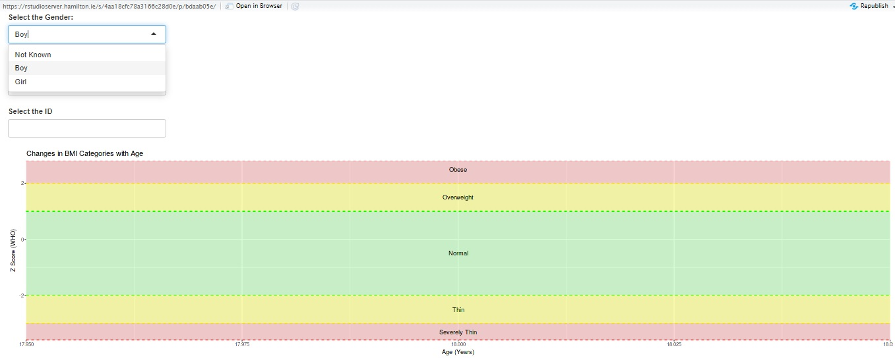
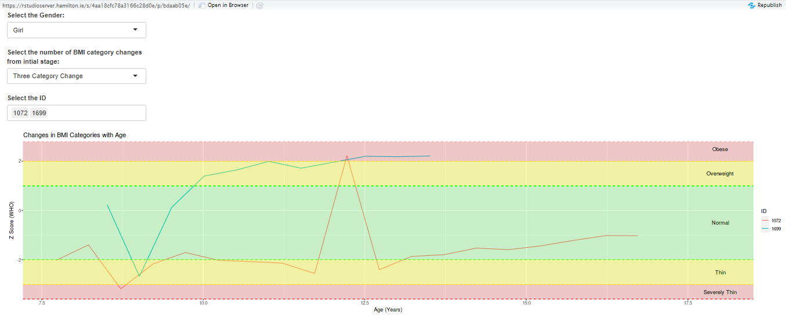
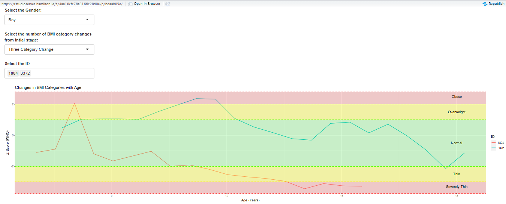
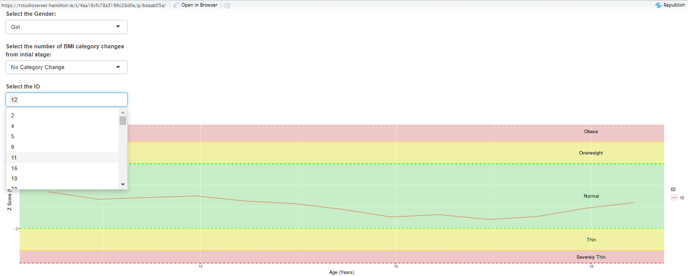
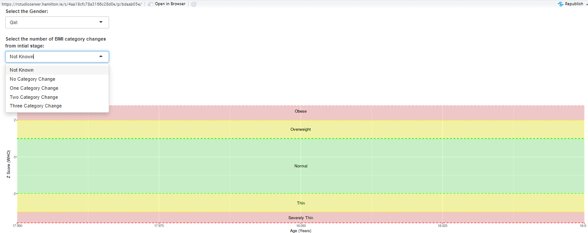
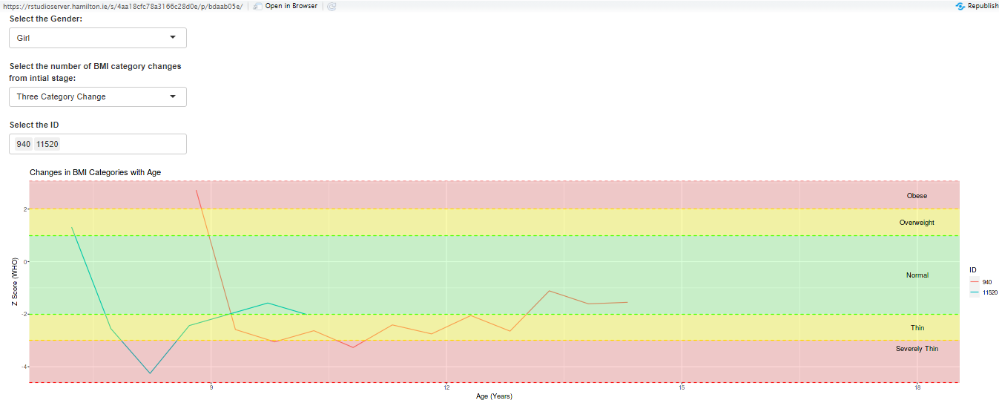
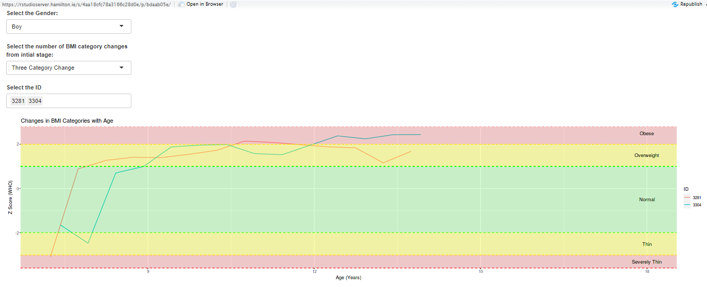
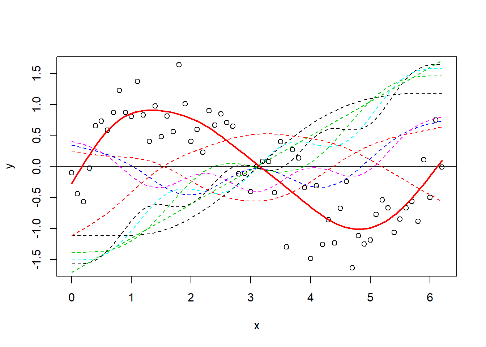

---
output:
  pdf_document:
    number_sections: yes
  html_document:
    df_print: paged
geometry: left=3.8cm,right=2.5cm,top=2.5cm,bottom=2.5cm
papersize: a4
header-includes: \usepackage{amsmath} \usepackage{pdflscape} \usepackage{caption}
  \usepackage{leading} \usepackage{setspace}
bibliography: bibliography.bib
---
\onehalfspacing

\newpage                  <!-- new page -->
\thispagestyle{empty}

```{r, include=TRUE, echo=FALSE, message=FALSE, warning=FALSE, fig.pos="h!", fig.align="center", out.height="25%"}
  knitr::include_graphics("logo.jpg")
```

\begin{center}          % <!-- center text -->

\bigskip                % <!-- blank lines -->
\bigskip

\Large
\textbf{DATA SCIENCE AND ANALYTICS DISSERTATION}

\bigskip                % <!-- blank lines -->
\bigskip

\textbf{Classification of bow shock and magnetopause event positions by using the Magnetic Field properties of Saturn} % <!-- make large text -->

\bigskip                % <!-- blank lines -->
\bigskip

\Large{A thesis submitted in fulfillment of the requirement for the \\
degree of M.Sc. in Data Science and Analytics.}

\bigskip                % <!-- blank lines -->
\bigskip

\large{Author:}
\large{Mathews Philip Venattu (20250487)}

\large{Supervisor:}
\large{Dr. Katarina Domijan}

\bigskip                % <!-- blank lines -->
\bigskip

\large{Department of Mathematics and Statistics\\
University: National University of Ireland, Maynooth.\\
Date Submitted: 10th July, 2021}

\end{center}              <!-- end center -->

\newpage 

\thispagestyle{empty}

\begin{center}

\large{Abstract}

\end{center}

\bigskip


Cassini-Huygens Space Research mission was a joint collaboration of NASA, ESA and Italian Space agency to study about the planet Saturn and its system that includes its Rings and Natural Satellites. During its life span of about 20 years the spacecraft orbited the planet Saturn for 13 years and also frequently changed its shape and tilt. Because of this frequent changes in the orbital trajectory of spacecraft, it passed multiple times through the boundaries of Bowshock and Magnetopause at different latitude, longitude and phases of Solar Cycle. In this Project, based on the Magnetic Field data collected during the year 2005 from MAG (Magnetometer) instrument attached to the spacecraft was used to Classify the different boundary crossings of CASSINI  Spacecraft. MAG (Magnetometer)in Cassini recorded the strength and direction of the Magnetic field around the spacecraft. Different Statistical models were used for the classification and those models were carefully examined to get more insights about magnetic field properties during different events. In this project, different trial and error approaches were taken to create a training dataset that gives better test accuracy on test dataset.  

```{r, include=TRUE, echo=FALSE, message=FALSE, warning=FALSE, fig.pos="h!", fig.align="center", out.height="25%"}
  #knitr::include_graphics("logo.jpg")
```


\newpage 
\thispagestyle{empty}
\tableofcontents

\newpage
\pagenumbering{arabic}
# List of tables{-}
\renewcommand{\listtablename}{} <!-- removes default section name -->
\listoftables

\newpage
# List of figures{-}
\renewcommand{\listfigurename}{}
\listoffigures

\newpage

# Introduction{#intro}

All planets in our solar system have magnetic field like earth. Some of the planets like Uranus, Saturn, Jupiter, and Neptune has large magnetic field than earth. Magnetosphere of an astronomical object is the area surrounding that object where its Magnetic field is present. Like all other planets Saturn also has the similar magnetosphere structure - it has a Bow shock, Magneto sheath, Magneto pause and Magneto tail. Among this structure bow shock is the point at which the Magnetosphere of the Saturn interacts with the solar wind that in turn suddenly reduces its speed and pressure. Magneto pause is the boundary between Saturn’s Magnetic field and Solar wind. The magneto sheath exists between the bow shock and the magneto pause, an area of shocked solar wind that is significantly influenced by the changes that occur within the bow shock and whose features can impact the interaction across the magneto pause. The dynamic pressure of Solar wind usually determines boundary and position of Magneto pause and Bow shock [2]. The Cassini Huygens Mission is a joint NASA/ESA/ASI project to make a detailed survey of the ringed planet Saturn and its natural satellites. Cassini spacecraft recorded magnetic field and plasma condition of the environment during its insertion to Saturn’s orbit by using the Cassini Magnetometer (MAG), Plasma Spectrometer (CAPS). The magnetic field strength pattern clearly shows some “overshoot” and “foot” when the spacecraft passed through the boundaries of Magnetopause, Bow shock and Magneto sheath [3]. The Magnetometer (MAG) which continuously acquired magnetic field data that is associated with the Plasma Environment and internal source of Saturn are essential to study about the interaction between solar wind and Magnetosphere of Saturn.

\bigskip                 <!-- blank lines -->
\bigskip

```{r, include=TRUE, echo=FALSE, message=FALSE, warning=FALSE, fig.pos="h!", fig.align="center", out.height="25%"}
  
```

\bigskip                 <!-- blank lines -->
\bigskip

Magnetosphere of Saturn act as an obstacle to the Solar wind far away from the planet and the magnetopause of the planet Saturn lies in 20 Rs (Radius of Saturn=60330 km). So, the Solar wind which interact with the magnetosphere is decelerated by the bow shock and the physical properties of the plasma (@sergis2013). The magneto disk pressure, which inflates the equatorial magnetosphere considerably more than the high-latitude magnetosphere, affects the geometry of the magnetopause boundary itself, resulting in clear polar flattening [5]. In the case of Earth, basic pressure balance is due to the interaction between upstream solar wind flow against magnetic pressure from the magnetosphere and this helps to draw the approximate location of magnetopause boundary but when it comes to Saturn we must consider the influence of the natural satellite Enceladus, which serves as a huge internal plasma source. The pressure related with the super thermal component of this internally produced plasma serves to inflate the magnetosphere considerably beyond what a basic magnetic pressure calculation would predict [6]. So even in a steady solar wind conditions, Due to the internal plasma mentioned above the magneto pause boundary of Saturn may move significantly. 

Lots of studies were done based on the data acquired from the Cassini Spacecraft instruments. (@sergis2013) they chose intervals between 2004 and 2011 when the spacecraft was travelling through the magnetic sheath and used the data recorded to explore different properties like plasma, energetic particle, magnetic field density, temperature etc. They concentrated more on the presence of W+s ions (water group) and explained the ejection of energetic ions as a function of pitch angle and energy which shows the often flow of heavy energetic ions from bow shock. Analysis of CAPS (Cassini Plasma Spectrometer) by Burkholder et. al [8] shown the significant ion flow differences prenoon and post noon, and apart from the magnetic field data was used to illustrate the rotation of IMF (Inter Planetary Magnetic Field) vector.

Based on literature survey, I got information regarding the different variables in the dataset like Magnetic field, direction of cross, position of the spacecraft etc. In this project we are only considering the bow shock and magnetopause crossing of the spacecraft during the year 2005. This report explains about the entire project with different sections like Background, Dataset explanation,	Data Manipulation, Data Visualization, Models trained to classify the type of crossings, R code used, summary of the results and conclusion. Background section explains about the different terms used and current approaches done by others for classification. In Dataset explanation section it explains about each variable and the different datasets that were used for this project. Data Manipulation section gives a detailed explanation about the transformations and imputations done on the dataset. New dataset made after data manipulation is explained visually on the data visualization section. There are different models tried to achieve better results each model that are used for this project is explained on this part of the report. Remaining portions explains about the code and its results.


\newpage

# Background

In the early days, Scientists have very less information regarding the Planet Saturn and its magnetosphere because as we all know that the magnetic fields are invisible, and it needs to be studied from inside. Cassini Huygens mission was a great opportunity for the science world to explore the planet and its behaviour. This mission helped to study the magnetic field and the flow of different gases under the influence of the magnetic field which affects the auroras of Saturn. This mission given some powerful insights about the atmosphere and the surrounding of Planet Saturn. By comparing Saturn with the similar exoplanets will give information regarding the evolution of the Solar System. Different studies were done based on the data gathered from the Cassini spacecraft. Based on this data [9] demonstrated that polar flattening of the magnetopause causes shorter streamline pathways over the poles, resulting in a higher-pressure gradient, which twists the field. This in turn leads to different conditions at the magnetopause when compared to those predicated based on axisymmetric assumptions. From 2004 day 299 through 2012 day 151, a substantial data was compiled by [10] of magneto sheath measurements was collected using data from CAPS, MAG, and MIMI. This data collection enables researchers to investigate things like local temporal dependence of magneto sheath parameters. They also demonstrated a new method for estimating upstream solar wind speed using the same	 magneto sheath parameters. [11] used the MAG data for research which provides a broad picture of low-frequency waves in Saturn's magnetosphere, which has crucial consequences for how magnetospheric energy leaks.

Both the Bow shock and magneto pause models can be used as a significant tool which gives insights about the solar upstream conditions and its dynamic pressure at which they are associated. All the data associated with Cassini uses KSM coordinate system and this system is Saturn centred where the x -axis is towards the sun [13]. Orbital tour of Cassini around Saturn which started in the month of July 2004 during that time the spacecraft crossed 100 Bow Shock boundaries. A study done by [12] On 11th and 12th of April 2005, Cassini magnetometer readings were made during a typical sequence of Cassini bow shock crossings. The spacecraft began and finished the period downstream of the shock in the magneto sheath solar wind, with two trips into the upstream solar wind, each separated by two shock crossings. The presence of obvious shock ramps and a constant upstream field indicates that these are quasi-perpendicular crossings. During this time magnetic field strength values recorded by the magnetometer were so high. In this report I analysed the magnetometer and position data of Cassini spacecraft during the year 2005 to classify the Magnetopause and Bow Shock events.


\newpage

# Data

Cassini Spacecraft orbited around the Saturn for about 9 years.During this period the spacecraft transmitted valuable information regarding Saturn  like the magnetic field strength, position at which it was measured to earth. Magnetometer and CAPS are the main instruments that were used for measuring the magnetic field strength and Kinetic Energy of particles at each point. For this project, I am only considering the data that was recorded during the year 2005 by the spacecraft. Mainly two datasets were used in this project to make a final combined useful dataset, first dataset contains a list of Bow Shock and Magneto pause event crossings that occurred during the year 2005 (Jackman et. al,2019). The second dataset contains the information regarding the position of spacecraft and the vector data of Magnetic field strength. 

## Dataset 1: Magnetopause And Bowshock Crossing List 

This dataset only contains the data of the year 2005 and that was originally developed by compiling two datasets that are posted in the MAPSView webpage (http://mapskp.cesr.fr/BSMP/index.php) which contains the Bow Shock and Magnetopause event crossings between 2004 day 179 and 2007 day 349 (H.J. McAndrews, S.J. Kanani, A. Masters, and J.C. Cutler) through visual identification of CAPS and MAG data. The second list of data has the magnetopause crossings during the year 2004 to October 2010 and May 2012 to February 2013 [6]. 

This dataset contains seven variables: `year_cross`, `doy_cross`, `doyfrac_cross`, `hour_cross`, `minute_cross`, `type_cross`, `dirn_cross`, `xcrosslist`, `ycrosslist`, `zcrosslist`

  
```{r, echo=FALSE, message=FALSE , warning=FALSE}
suppressMessages(library(ggplot2))
suppressMessages(library(cowplot))
suppressMessages(library(plotly))
suppressMessages(library(dplyr))
suppressMessages(library(tidyverse))
suppressMessages(library(mgcv))
WD <- getwd()
if (!is.null(WD)) setwd(WD)
raw_data_1<-readRDS('./Data/dataset_version_0/Full_Cassini_Master_MP_BS_CMJ_revised2005.rds', refhook = NULL)
glimpse(raw_data_1)
```
<b><u>Variable Description</u></b>

* `year_cross`: It contains a numeric value of the year in which spacecraft crossed the event.
* `doy_cross `: It contains a numeric value of the day on which spacecraft crossed the event.
* `hour_cross`: It contains a numeric value of the hour at which spacecraft crossed the event.
* ‘minute_cross `: It contains a numeric value of the minute at which spacecraft crossed the event.
*	`doyfrac_cross`:  `doy_cross` + (`hour_cross`*60+`minute_cross`)/(24*60) 
*	`type_cross`: This is a categorical variable contains information about what type of event did the spacecraft crossed. 
    +	**MP**: Magnetopause
    +	**BS**: Bow Shock
    +	**DG**: Data gap
    +	**SC**: SCAS interval which are unreliable data
*	`dirn_cross`:  This is also a Categorical variable that contains information regarding in which direction did the spacecraft moved.The direction categories in this variable are:
    +	**in**: Inbound means the spacecraft is moving towards the planet.
    +	**out**: Outbound means the spacecraft is moving away from the plant.
    +	**S_SW**: Starts with the solar wind is the region at which spacecraft recorded values at the start of solar wind.
    +	**S_SH**: Starts with Magneto sheath is the region at which spacecraft recorded values at the start of magneto sheath.
    +	**S_SP**: Starts with Magnetosphere is the region at which spacecraft recorded values at the start of magnetosphere.
    +	**E_SW**: Ends with the solar wind is the region at which spacecraft recorded values at the end of solar wind.
    +	**E_SH**: Ends with Magneto sheath is the region at which spacecraft recorded values at end start of magneto sheath.
    +	**E_SP**: Ends with Magnetosphere is the region at which spacecraft recorded values at the end of magnetosphere.
  
For an inbound the first event that will occur is a Bow Shock and later followed by Magnetopause. But in the case of an outbound direction the first event that occur will be a Magnetopause and later followed by a Bow Shock. Region of sampling at the start of any data gap will have a S_SW, S_SH and S_SP direction type and Region of sampling at the end of data gap E_SW, E_SH and E_SP. Dimension of this dataset is (480,10).

## Dataset 2: Magnetometer Dataset

In this dataset it contains the magnetometer data of Cassini Spacecraft during the year 2005.
Time difference between each Data points is one minute which means each data point represents the data of a particular minute. The data in this dataset are provided in the KSM (Kronocentric Solar Magnetospheric) Coordinate system which is a kind of Saturn centred Coordinate system where direction of X is from Saturn to the Sun	and X-Z plane of the Coordinate system contains the Saturn centred axis of Magnetic Dipole ‘M’. 

  
```{r, echo=FALSE, message=FALSE , warning=FALSE}

raw_data_2<-readRDS('./Data/dataset_version_0/Cass_data2005.rds', refhook = NULL)
glimpse(raw_data_2)
```

Some of the relevant variables in the dataset are:

* `X_KSM.km.`: This is the X coordinate point value  of the spacecraft in KSM Coordinate System.
*	`Y_KSM.km.`:  This is the Y coordinate point value of the spacecraft in KSM Coordinate System.
*	`Z_KSM.km.`: This is the Z coordinate point value of the spacecraft in KSM Coordinate System.
*	`Timestamp.UTC.` : It is the timestamp  at which data point was recorded by the Magnetometer.
*	`DOY.UTC.` : It tells about the day at which the datapoint was recorded in the year 2005.
*	`BX_KSM.nT.`: It is the x component of magnetic field strength in Amperes/meter.
*	`BY_KSM.nT.`: It is the y component of magnetic field strength in Amperes/meter.
*	`BZ_KSM.nT.`: It is the z component of magnetic field strength in Amperes/meter.
*	` BTotal.nT.` : It is the resultant vector of Bx, By and Bz

\begin{equation}
 	B_{Tot} = \sqrt{Bx^2 + By^2 + Bz^2}
\end{equation}

This dataset contains 494683 rows and 12 columns.

## Dataset 3: Combined Data Of Dataset 1 And Dataset 2

This is a newly created dataset by merging dataset 1 and dataset 2 So, that we can understand the Magnetic field properties during the events like Magnetopause and Bow Shock.  For merging the two datasets I used date and time as the key. To format the date in Dataset 1 I used the `doy_cross` variable in each row adding to “2004-12-31” date. By doing so it will generate a date with respect to the reference date.  In dataset 2 the variable `Timestamp.UTC.` is in string format inorder to convert it into a data format I used `as.POSIXct()` function with `format="%d/%m/%Y %H:%M"`. Later I have converted the ` Timestamp.UTC.` variable into a new format and which is then stored in the `date` variable. Two new variables are also created in the Dataset 2 known as `hour_cross` and `minute_cross`. `left_join()` function was used for merging the two datasets by using the variables `date`,`hour_cross` and `minute_cross` which is common on dataset 1 and dataset 2. In the newly created dataset it contains all the variables of dataset 1 and dataset 2. The dimesnsion of the newly created dataset is 494683 rows and 19 columns. Some of the variables are removed from the dataset because we know that dataset 1 has very less number of datapoints when compared to dataset 2 So, it is better remove the variables like `xcrosslist`, `ycrosslist`, `zcrosslist`, `year_cross`, `doy_cross`,`SCET.s.`, `doyfrac_cross`, `hour_cross` and `minute_cross` from the merged dataset. Data manipulations and Visualizations were done on this newly created dataset.

  
```{r, echo=FALSE, message=FALSE , warning=FALSE}
raw_data_3<-readRDS('./Data/dataset_version_0/joined_data.rds', refhook = NULL)
glimpse(raw_data_3%>%select(-c(xcrosslist,zcrosslist,ycrosslist,year_cross,doy_cross,doyfrac_cross,hour_cross,minute_cross,'SCET.s.')))
```
 After removing some of the variables, now the modified dataset hass 494683 rows and 16 columns.
 
\newpage

# Data Manipulation Section

In this section will explain about the data manipulation that was done on the merged dataset (dataset 3). There were lots of NA values in different predictors, so it is important to impute these values before using it for training the models.

```{r, echo=FALSE, message=FALSE ,results='hide'}

suppressMessages(library(ggplot2))
suppressMessages(library(cowplot))
suppressMessages(library(plotly))
suppressMessages(library(dplyr))
suppressMessages(library(tidyverse))
suppressMessages(library(mgcv))
WD <- getwd()
if (!is.null(WD)) setwd(WD)
load('dataset.rdata')
#load('~/dataset.rdata')
data.frame(ena)[1:5,]

```


## REMOVING TIME DEPENDENCY

Since all the datapoints were recorded by the spacecraft using the instruments over time so, there can be a time dependency. To remove the time dependency, I made the dataset wider which means a thirty-minute window was used for each data point and stored the magnetic field strength values and position of the spacecraft at each minute as a column for each row. Now for each data point there are 219 columns. I have labelled each column in the format (predictor_name{minute_index}) For example, the BX_KSM16 represents the BX_KSM value after one minute of the selected datapoint. Since all time-dependency variables need to be removed So, in this dataset the variable Timestamp.UTC. ` was removed for this purpose. 

## DATA IMPUTATION

In this dataset there are many NA values in different predictors like `type_cross` and `dirn_cross`. Since `type _cross` and `dirn_cross` are both categorical variables So, it is critical to impute the NA values with relevant short terms. `type_cross` variables represents the type of event at which the spacecraft crossed. Currently `type_cross` variable has values `MP`, `BS`, `DG` and `SCAS` which represents Magnetopause, Bow shock, Data gap and Unreliable data. All the other data than the above-mentioned categories in the newly created dataset can be categorized as `NE` which means No Events Occurred.

For `dirn_cross` variable, which represents the direction at which spacecraft is moving. This variable has the categories E_SH, E_SP, E_SW, I, O, S_SH S_SP and S_SW. So, I have imputed all the datapoints which has NA values in `dirn_cross` as `UD` (Unknown Direction) which means the direction of the spacecraft when that datapoint was recorded is Unknown. 

\newpage

# Exploratory Data Analysis

The dataset contains the records of more than 490000 magnetometer readings with labels of type of crossing, Magnetic filed strength values of fifteen minutes before and after of a datapoint and position of the spacecraft at which the data was recorded. The orbits of the spacecraft covered almost all local hours and gave sufficient dayside coverage. Before getting into further analysis its important to understand whether the data is imbalanced or not.

To find out the kids whose data were recorded from 2007 till 2018, a common subset of ID has been taken out by comparing the data of each consecutive year and a set of kids ID has been recognized whose measurements were taken as per the requirement i.e., 2007-2018. A total of 141 participants were identified and found eligible for the analysis who has been continuously measured throughout 2007-2018. After that, as per the ID, all the associated records corresponding to those IDs were filtered out. These 141 participants had 3002 records which were taken each year from 2007 to 2018 and are used for model building and analysis.

A few records and the parameters of the dataset are shown below:  

```{r,echo=FALSE, message=FALSE}

data.frame(a_unique_07)[1:5,]

```

\begin{center}
\captionof{table}{Participants with continuous measurements from 2007 to 2018}
\begin{tabular}{|l|l|l|l|}
\hline
Serial No. & Gender & Participants & Number of Records \\ \hline
1 & Boy & 65 & 1381 \\ \hline
2 & Girl & 76  & 1621 \\ \hline
Total & All & 141 & 3002 \\ \hline
\end{tabular}
\end{center}

\newpage

For the initial investigation, it is vital to check the weight change pattern of 141 participants with an increase in age. The graph of weight change with the increase in age has been plotted for boys and girls separately to point out any differences.

```{r, echo=FALSE, message=FALSE, fig.width=4, fig.height=2.5}

a_unique_07$is_boy <- as.factor(ifelse(a_unique_07$gender=='boy', "1", "0"))
#Boys Weight
a_unique_07_boys <- filter(a_unique_07, gender=="boy")
b <- ggplot(a_unique_07_boys, aes(x=age_years, y=weight_kg, color=ID)) + 
  geom_line() + theme(legend.position = "none") + 
  ggtitle("Weight of all Boys ") +
  xlab("Age (Years)") +
  ylab("Weight (Kg)") +
  ylim(0,140) +
  theme(text = element_text(size=16,color = "Black"))+
  theme(strip.text = element_text(size=12))

#Girls Weight
a_unique_07_girls <- filter(a_unique_07, gender=="girl")
g<-ggplot(a_unique_07_girls, aes(x=age_years, y=weight_kg, color=ID)) + 
  geom_line() +
  theme(legend.position = "none") + 
  ggtitle("Weight of all Girls")+
  xlab("Age (Years)") +
  ylab("Weight (Kg)") +
  ylim(0,140) +
  theme(text = element_text(size=16,color = "Black"))+
  theme(strip.text = element_text(size=12))

```

```{r, echo=FALSE, message=FALSE, fig.width= 12, fig.height=4,fig.cap="Weight Change of all 141 kids with age\\label{fig:weight of boys and girls}"}

plot_grid(b,g)

```

From the above plots, it can be observed that at ages 6 and 7 most of the boys' weight ranges approximately below 27kg while for girls the range is between 15kg to 35kg. Although both boys and girls have almost constant weight increase rates, it can be seen that after the initial few ages (age 6 to 9) boys' weight increase is more as compared to girls. Hence, as a preliminary analysis, we can roughly assume from this visualization that boys are comparatively heavier than the girls at the same age level.

\newpage

# Shiny App

In the previous preliminary visualization section, we have considered 3002 records from 141 participants. But there may be a requirement to check the weight changes for other participants as well. The shiny app is a good way to visualize the output as per the input. In this Shiny app, all the 94704 records from 14,267 participants were considered.

The structure of the Shiny app is designed in the way that, it will show the weight changes with the increase in age and will also indicate any changes in the Z-category (e.g: Normal, Obese, Thin, etc.) concerning the initial stage. The input fields in the Shiny app are Gender, Z-Category change from the initial stage, and ID. In case the 'Gender' or 'Z-Category change from initial stage' is not known can be selected as 'Not Known' and the ID can be entered directly in the ID input space. In another situation, if there is any requirement to compare BMI or Z-Category changes of multiple IDs or kids, that can be achieved by selecting those IDs and in the output space Z-Category changes for those selected IDs will be displayed with different colors pointing out specific IDs or kids.

## Gender Input Space

In the Gender input space, the valid fields which can be selected are Boy, Girl, or Not Known. In a typical situation, if the user is now aware of the gender he can select the gender as 'Not Known' and the next input space will consider all boys' and girls' IDs. If a boy is selected as gender only the boy's IDs will be considered for the next input selections and will appear on the ID input space.

```{r, include=TRUE, echo=FALSE, message=FALSE, warning=FALSE, fig.pos="h!", fig.align="center", out.height="25%",fig.cap="Shiny App: Change of Z category with Z score(Gender Selection)\\label{fig:zcat1}"}

```

\newpage

## Z-category change from initial stage Input Space

There are five different BMI categories or Z-Categories depending on the Z-scores. The different Z-categories are:

* Obese
* Overweight
* Normal
* Thin
* Severely Thin

In this input space, the selection should be done based on the number of changes in Z-Category from the first observed Z-Category. If the changes in Z-Category are unknown to the user ' Not Known' can be selected and it will consider all Z-Category changes in the next input space. The valid selections in this input space are as follows:

* Not Known - BMI or Z-Category change is unknown.
* No Category Change - There is no BMI category change from the first observed BMI category or Z-Category.
* One Category Change - There is only one BMI category change from the initial stage. E.g: If a kid's first observed BMI category is normal and the kid was been in the overweight category and later come back to normal weight category with age, then it is considered as One Category Change, as it has been to one of the other BMI categories except the initial BMI category.
* Two Category Change - There is two BMI category change from the first observed BMI category or Z-Category.
* Three Category Change - There is three BMI category change from the first observed BMI category or Z-Category.

```{r, include=TRUE, echo=FALSE, message=FALSE, warning=FALSE, fig.pos="h!", fig.align="center", out.height="25%", fig.cap="Shiny App: Change of Z-Category with Z-Score(BMI or Z-Category Change Selection)\\label{fig:zcat1}"}
knitr::include_graphics("2.png")
```

\newpage

## ID Selection Input Space

After gender and the BMI category change input space, in this input space ID need to be selected or can be written manually. If there is a requirement of comparing Z-Category changes of multiple kids, multiple IDs can be selected. 

```{r, include=TRUE, echo=FALSE, message=FALSE, warning=FALSE, fig.pos="h!", fig.align="center", out.height="25%",fig.cap="Shiny App: Change of Z category with Z score(ID Selection)\\label{fig:zcat1}"}

```

The different colored regions in the graph refer to how the Z-category is changing with an increase or decrease in Z-score(WHO).

\newpage

## Kids with big changes in Z-Category 

Here, the kids with maximum changes in Z-Category (three category change from the initial stage) has been identified and their Z-category change has been analyzed from the initial year to the final year i.e, 2007-2018.

**BOYS**

Kids with IDs 3381, 3304, 1804, and 3372 have shown a big change in BMI Categories or Z-Categories in case of Boys.

```{r, include=TRUE, echo=FALSE, message=FALSE, warning=FALSE, fig.pos="h!", fig.align="center", out.height="25%",fig.cap="Z-Category Change for Boys with ID 3281 and 3304\\label{fig:zcat1}"}

```

It can be seen that the initial Z-Category for ID 3281(Red) and 3304(Green) were severely thin and normal, but with an increase in age both the kids have an increased trend in Z-score and eventually turned into overweight(3281) and obese(3304). Therefore, it can be assumed that there is a high chance for the kid(3281) to become obese in the future if necessary consultation is not taken.

```{r, include=TRUE, echo=FALSE, message=FALSE, warning=FALSE, fig.pos="h!", fig.align="center", out.height="25%",fig.cap="Z-Category Change for Boys with ID 1804 and 3372\\label{fig:zcat1}"}

```

Similarly, for both ID 1804(Red) and 3372(Green), the initial stage or Z-category was normal, but there are multiple category changes for both of them with the increase in age. The ID 1804 has been drifted to the obese category before finally came down to a severely thin category, while ID 3372 has also been shifted to the obese category but eventually came to the normal followed by thin category. 

**GIRLS**

In the case of girls, 940, 1072, 1699, and 11520 are the IDs showing big Z-Category changes.

```{r, include=TRUE, echo=FALSE, message=FALSE, warning=FALSE, fig.pos="h!", fig.align="center", out.height="25%",fig.cap="Z-Category Change for Girls with ID 940 and 11520\\label{fig:zcat1}"}

```

The kids with IDs 940(Red) and 11520(Green) have their initial Z-Categories as obese and overweight respectively but both shifted to the normal category in their final stage. It can be observed that both the kids have been overweight, severely thin, and thin categories before switched in the final normal stage.

```{r, include=TRUE, echo=FALSE, message=FALSE, warning=FALSE, fig.pos="h!", fig.align="center", out.height="25%",fig.cap="Z-Category Change for Girls with ID 1072 and 1699\\label{fig:zcat1}"}

```

The kids with IDs 1072(Red) and 1699(Green) have initial stages thin and normal respectively. The final stage for the kid with ID 1072 is normal but this kid has been to thin, severely thin, and obese categories as well before her final normal Z-Category, while the girl with ID 1699 was been into thin and overweight categories before being her final obese stage. Therefore, it is highly recommended for the kid with ID 1699 to consult a specialist and follow medication if required.

**Shiny App URL:** https://sankhadip.shinyapps.io/thesis_shiny/

\newpage

# BMI Abnormality Detection

## Detecting BMI abnormalities with Age

The dataset used for model building and analysis consists of 3002 records from 141 participants and measurements for all participants were taken consistently from 2007 to 2018. Therefore, each participant was at age 6 or 7 at the beginning of this study (2007). In this section, it has been tried to find out at what age kids are more likely to deviate from normal to abnormal BMI range, which can be thin, overweight, obese, or severely thin. 

```{r, echo= FALSE, message=FALSE}

#Boys
#Checking Thin, Severely Thin, Obese and Overweight Counts each year for boys

zcat_boy<-a_unique_07_boys %>% group_by(age_mod, z_cat_WHO) %>%
  dplyr::summarise(count=n())

#a_unique_07_boys %>% group_by(age_mod, z_cat_WHO)%>%filter((z_cat_WHO)%in% c('obese','overweight','thin','severely thin'))%>%  dplyr::summarise(count=n())

abnorm_boy<-zcat_boy %>% filter((z_cat_WHO)%in% c( 'obese', 'overweight','thin','severely thin'))

zcat_boy_long<-abnorm_boy %>% pivot_wider(names_from = z_cat_WHO, values_from = count)

zcat_boy_long <- replace(zcat_boy_long, is.na(zcat_boy_long), 0)

zcat_boy_long$total<-zcat_boy_long$obese + zcat_boy_long$overweight + zcat_boy_long$thin + zcat_boy_long$`severely thin`

zcat_boy_long <- replace(zcat_boy_long, zcat_boy_long == 0, NA)

#Visualizing no of obese, overweight, thin and severely thin count with age.
i<-ggplot(zcat_boy_long)+
  geom_line(aes(x=age_mod, y= obese, colour = "obese")) +
  geom_line(aes(x=age_mod, y= overweight, colour = "overweight"))+
  geom_line(aes(x=age_mod, y= thin, colour = "thin")) +
  geom_line(aes(x=age_mod, y=`severely thin`, colour = "`severely thin`")) +
  scale_colour_manual(name = "Legends", breaks = c("obese", "overweight",  "thin", "severely thin"), 
                      values = c("red", "blue", "green", "pink")) +
  ggtitle("BMI Category Counts (Boys)") +
  xlab("Age") + ylab("Counts") + ylim(0,20) +
  theme(text = element_text(size=16,color = "Black", face = "plain"))+
  theme(strip.text = element_text(size=12))

#Visualizing total count of abnormality with age.
total_ab_boys <- ggplot(zcat_boy_long)+
  geom_line(aes(x=age_mod, y= total), color = 'blue') +
  xlab("Age") + ylab("Counts") + ylim(0,35) +
  ggtitle("Count of BMI abnormalities (Boys)") +
  theme(text = element_text(size=16,color = "Black", face = "plain"))+
  theme(strip.text = element_text(size=12))

```

```{r, echo= FALSE, message=FALSE}

#Girls

#Checking Thin, Severely Thin, Obese and Overweight Counts each year for Girls

zcat_girl<-a_unique_07_girls %>% group_by(age_mod, z_cat_WHO) %>%
  dplyr::summarise(count=n())

#a_unique_07_boys %>% group_by(age_mod, z_cat_WHO)%>%filter((z_cat_WHO)%in% c('obese','overweight','thin','severely thin'))%>%  dplyr::summarise(count=n())

abnorm_girl<-zcat_girl %>% filter((z_cat_WHO)%in% c( 'obese', 'overweight','thin','severely thin'))

zcat_girl_long<-abnorm_girl %>%
  pivot_wider(names_from = z_cat_WHO,
    values_from = count)

zcat_girl_long <- replace(zcat_girl_long, is.na(zcat_girl_long), 0)

zcat_girl_long$total<- zcat_girl_long$obese + zcat_girl_long$overweight + zcat_girl_long$thin

zcat_girl_long <- replace(zcat_girl_long, zcat_girl_long == 0, NA)

#Visualizing no of obese, overweight, thin and severely thin count with age.

j<-ggplot(zcat_girl_long)+
  geom_line(aes(x=age_mod, y= obese, colour = "obese")) +
  geom_line(aes(x=age_mod, y= overweight, colour = "overweight"))+
  geom_line(aes(x=age_mod, y= thin, colour = "thin")) +
  scale_colour_manual(name = "Legends", breaks = c("obese", "overweight",  "thin", "severely thin"), 
                      values = c("red", "blue", "green", "pink")) +
  ggtitle("BMI Category Counts (Girls)") +
  xlab("Age") + ylab("Counts") + ylim(0,20) +
  theme(text = element_text(size=16,color = "Black", face = "plain"))+
  theme(strip.text = element_text(size=12))

#Visualizing total count of abnormality with age.
total_ab_girls <- ggplot(zcat_girl_long)+
  geom_line(aes(x=age_mod, y= total), color = "red") +
  xlab("Age") + ylab("Counts") + ylim(0,35) +
  ggtitle("Count of BMI abnormalities (Girls)") +
  theme(text = element_text(size=16,color = "Black", face = "plain"))+
  theme(strip.text = element_text(size=12))

```

```{r, echo= FALSE, message=FALSE, warning= FALSE, fig.width= 12, fig.height=4.5,fig.cap="Abnormality in BMI Categories with Age (Boys and Girls)\\label{fig:abnormality}"}

#Comparing all weight abnormalities of Boys and Girls
prow <- plot_grid( i + theme(legend.position="none"),
           j + theme(legend.position="none"))
legend <- get_legend(i)
plot_grid( prow, legend, rel_widths = c(8,1))

```

The above plot shows the different abnormal BMI categories and their overall counts with age for 141 participants (boys - 65 and girls - 76). It can be implied that both boys and girls have a high tendency to become overweight and obese, a very small chance of being thin and almost no chance of being a severely thin kid. 

From the Boys' plot, it can be clearly observed that boys are more tend to become obese as compared to overweight. There is a steep rise in obesity pattern can be seen between age 10 to 12 and after that, downfall in that curve can be seen. Similarly, during this period fluctuating trend of rise and fall in overweight can also be observed and consecutive fall can be seen after this age period. Besides, there is a sudden spike in overweight can also be seen between ages 7 to 8 and 16 to 17. Hence, it is evident that at age 10 to 12 boys are much vulnerable to become obese and very much unlikely to become thin or severely thin.

Girls plot reveals different BMI category patterns than boys. From the girls' plot, we can discover that girls are more tend to become overweight than to face obesity. The graph shows that during age 7 to 12 girl tends to become deviated from normal BMI category to overweight. There is an immediate spike in the overweight curve during age 14.5 to 15 as well. Similarly like overweight patterns, there are numbers of girls who are very likely to become obese during the age range 7.5 to 13 and a gradual decrease in the obese pattern after that can be seen. Girls also have the same pattern of thin BMI category as boys, with very less number of girls became thin during these 12 years.

\newpage

## Total Count of BMI Abnormalities with Age{#bmi}

The total count of BMI abnormalities represents the total number of overweight, obese, thin, and severely thin categories with an increase in age. The total counts of abnormalities have been summed with age and has been plotted below. This represents the total number of deviations from the normal BMI category with age.

```{r, echo= FALSE, message=FALSE, warning= FALSE, fig.width= 12, fig.height=4.5,fig.cap="Number of Overall BMI abnormalities with Age (Boys and Girls)\\label{fig:overall_abnormality}"}

#Comparing overall weight abnormalities of Boys and Girls
plot_grid(total_ab_boys, total_ab_girls)

```

It is clearly visible that girls are more likely to drift from normal weight status at any point in time. Approximately, during ages 10 to 12, there are high chances for boys to become shifted from normal BMI range and to become overweight, obese, or thin. There are also small spikes of increased abnormal BMI category patterns during the age of 7.5 to 8 and 16.5 to 17 as well. On the other hand, girls are more tend to diverge from their normal BMI category during the age range of 7.5 to 12.5.

\newpage

# Methods{#meths}

Several suitable methods are available for model building for these kinds of datasets, but the Generalized Additive Model (GAM) is preferred for model building and analysis. Generalized Additive Model (GAM) is quite flexible because there are no assumptions of the forms of the relationships between the response and predictors.

```{r, include=TRUE, echo=FALSE, message=FALSE, warning=FALSE, fig.pos="h!", fig.align="center", out.height="25%"}
  
```

Generalized Additive Model (GAM) is used for finding the overall BMI change among the kids with an increase in age. A generalized additive model (GAM) is a generalized regression model in which the vector predictor linearly relies on certain predictor variables' undefined smoothing functions, and attention relies on inferences regarding these smoothing functions. The model is related to certain predictor variables, $x_i$, by a univariate response vector, Y. For Y (e.g. natural, binomial, or Poisson distributions) an exponential family distribution is defined along with a connection function g (e.g. identity or log functions) that relates the predicted value of Y to the predictor variables via a structure like:

\begin{center}
$g(\operatorname {E}(Y))=\beta _{0}+f_{1}(x_{1})+f_{2}(x_{2})+\cdots+f_{m}(x_{m})$
\end{center}

Functions $f_i$ may be functions of a given parametric type (for example, a variable's polynomial or unpenalized regression spline) or maybe defined non-parametrically, or semi-parametrically, simply as 'smoothing functions' to be calculated by non-parametric means.
For a standard GAM a smoothing function, like a local weighted mean, might use a scatterplot function for $f_1(x_1)$ and instead use a control factor for $f_2(x_2)$. This versatility, which allows it possible to conform non parametrically to the true relationship between response and prediction, gives the possibility for increased data adaptation, albeit with some lack of interpretability, when compared with parametrical models.

Gam uses smoothing terms to provide non-linear model fitting, hence gam is used for model building for this dataset. A GAM model can be implemented with two different functions i.e., gam() and bam(). These functions are largely similar but the most significant difference is that bam() is an optimized version of gam() and is preferable for large datasets. Therefore, bam() is used for model building and this function is from the 'mgcv' package(@mgcv2019). 

Smoothing terms:
  
There are three different smoothing functions are available for modeling a potentially nonlinear smooth or surface.
s() can be used for modeling a 1-dimensional smooth or isotropic interactions which mean variables are measured in the same units and on the same scale).
te() is used for modeling 2- or n-dimensional interaction surfaces of variables that are not isotropic and also includes ‘main’ effects.
And for modeling 2- or n-dimensional interaction surfaces that do not include the ‘main effects’ ti() can be used.

The parameters of smoothing functions:
The smoothing functions have several parameters that could be set according to the change in parameter behavior. The most important and often-used parameters are listed here:
  
k: number of ‘knots’. This parameter determines the upper bound of the number of underlying base functions being used to build up the curve. Thus, this parameter constrains the wiggliness of a smooth, or - as a metaphor - the number of bow points of a curve. By default, the value of k for s() is around 9, and for te() and ti() 5 per dimension. Importantly, the value of k should be at most one less than the number of unique data points, otherwise, it will fit the density of that predictor.

d: It is used for specifying that predictors in the interaction are on the same scale or dimension (only used in te() and ti()). For example, in te(Time, width, height, d=c(1,2)), with width and height reflecting the picture size measured in pixels, we specify that Time is on a different dimension than the next two variables. By default, the value would be d=c(1,1,1) in this case.

bs: This specifies the type of underlying base function. For s() this defaults to “tp” (thin plate regression spline) and for te() and ti() this defaults to “cr” (cubic regression spline). For random intercepts and linear random slopes bs=“re” can be used, but for random smooths bs=“fs” is used.

Setting up a GAM model:
  
We have started with the age and height as predictors initially and used random effects to increase the model performance. Three different types of random effects are distinguished when using GAMs:
  
(i) random intercepts effect - It adjusts the height of other model terms with a constant value: s(ID, bs=“re”).

(ii) random slopes effect - It adjusts the slope of the trend of a numeric predictor: s(ID, age, bs=“re”).

(iii) random smoothing effect - It adjusts the trend of a numeric predictor in a nonlinear way: s(age, ID, bs=“fs”, m=1).

The bs generate the B-spline basis matrix for a polynomial spline and specifies the type of underlying base functions and besides, ID is a factor which is also considered as a group.

The Random intercepts and random slopes could be combined, but the random smooths already include random intercepts and random slope effects. The argument m=1 sets a heavier penalty for the smooth moving away from 0, causing shrinkage to the mean. Here we are using bam as gam takes a longer time for huge datasets. Bam is a similar and optimized version of gam for huge datasets. 

The dataset contains timely measured non-negative data where measurement has been taken in scheduled intervals, therefore, Gamma is used as a regression family. It has also been found that Gamma($link = "log"$) has given more satisfactory results as compared to normal Gamma family in terms of test errors and AIC. Hence, Gamma($link = "log"$) is preferred in the final model selection.

\newpage

# Results{#res}

## Model Selection

Several models were fitted to weight separately genderwise for verifying the model performance and the data has been trained in the training dataset and fitted on the test dataset for checking the test error. The model which has the lowest test error has been considered as the best model and used for analysis. AIC value and K fold cross-validation method with 7 folds has been used for this purpose.

**Boys**
\begin{center}
\captionof{table}{Model fitted for Boys data and the corresponding Test Errors and AIC}
\begin{tabular}{|l|l|l|l|}
\hline
Model (Predictors Used) & Family & Test Error & AIC \\ \hline
$age + height + intercerpt_{effect} + slope_{effect}$ & Gamma & 20.60 & 7664.12 \\ \hline
$age + height + smooths_{effect}$ & Gamma($link='log'$) & 5.57 &  5604.95 \\ \hline
\end{tabular}
\end{center}

**Girls**
\begin{center}
\captionof{table}{Model fitted for Girls data and the corresponding Test Errors and AIC}
\begin{tabular}{|l|l|l|l|}
\hline
Model (Predictors Used) & Model Family & Test Error & AIC \\ \hline
$age + height + intercerpt_{effect}+ slope_{effect}$ & Gamma & 14.67 & 8093.3 \\ \hline
$age + height + smooths_{effect}$ & Gamma($link='log'$) & 5.39  & 6592.57 \\ \hline
\end{tabular}
\end{center}

From the above table-3 and 4, it can be observed that the model which provides the least test error and most satisfactory result consists of predictors: age, height, and smooths effect with gamma($link='log'$) family. Also comparing these models show the same result with respect to AIC values.

Model-1: $weight = age + height + s(ID, bs="re") + s(ID, age, bs="re")$

Model-2: $weight = age + height + s(age,ID,bs="fs",m=1)$

```{r, echo=FALSE, message=FALSE}

model3_b <- bam(weight_kg ~ age_years + 
                  height_cm + 
                  s(ID, bs="re") + 
                  s(ID, age_years, bs="re"), family = 'Gamma',
                  data=a_unique_07_boys)

model4_b <- bam(weight_kg ~ age_years + 
                  height_cm + 
                  s(age_years, ID, bs="fs", m=1),family = Gamma(link = 'log'), 
                  data=a_unique_07_boys)

model3_g <- bam(weight_kg ~ age_years + 
                  height_cm + 
                  s(ID, bs="re") + 
                  s(ID, age_years, bs="re"), family = 'Gamma',
                  data=a_unique_07_girls)

model4_g <- bam(weight_kg ~ age_years + 
                  height_cm + 
                  s(age_years, ID, bs="fs", m=1),family = Gamma(link = 'log'),
                  data=a_unique_07_girls)

suppressMessages(library(itsadug))
compareML(model3_b, model4_b, print.output = FALSE)$table

```

Therefore, from the two models discussed above I will prefer Model-2: $weight = age + height + s(age,ID,bs="fs",m=1)$ for further analysis of the data. The model for girls also show the same results like boys.

\newpage

For validating the model performance, residual vs fitted values plot, Effects plot, Deviance Residuals and Theoretical Quantiles, & Residual histogram Plot can also be observed.

```{r,echo= FALSE, message=FALSE, fig.width= 12, fig.height=4.5,fig.cap="Residuals Vs Fitted Values Plot\\label{fig:res1}"}

#Boys
#Weight Prediction using the model 
a_unique_07_boys$pred_wt<-predict(model4_b,a_unique_07_boys, type='response')
a_unique_07_boys$fitted_values <- model4_b$fitted.values
a_unique_07_boys$residuals <- model4_b$residuals

#Girls 
#Weight Prediction using the model 
a_unique_07_girls$pred_wt<-predict(model4_g,a_unique_07_girls, type='response')
a_unique_07_girls$fitted_values <- model4_g$fitted.values
a_unique_07_girls$residuals <- model4_g$residuals

res_boys<-ggplot(a_unique_07_boys) + 
  geom_point(aes(x=fitted_values, y=residuals), shape = 21, size = 2, color =  "dark blue")+
  ggtitle("Residual Vs Fitted Values(Boys)")+ xlab("Fitted Values") +
  ylab("Residuals") +
  theme(text = element_text(size=16,color = "Black", face = "plain"))+
  theme(strip.text = element_text(size=12)) +
  geom_hline(yintercept=0, linetype="dashed", color = "red")

res_girls<-ggplot(a_unique_07_girls) + 
  geom_point(aes(x=fitted_values, y=residuals), shape = 21, size = 2, color =  "dark blue")+
  ggtitle("Residual Vs Fitted Values(Girls)")+ xlab("Fitted Values") +
  ylab("Residuals") +
  theme(text = element_text(size=16,color = "Black", face = "plain"))+
  theme(strip.text = element_text(size=12)) +
  geom_hline(yintercept=0, linetype="dashed", color = "red")

plot_grid(res_boys, res_girls)

```

From the above plot, it is visible that the residuals are randomly scattered over the mean zero lines, which is expected.

**Smoothing Effects Plot:** 

```{r,echo= FALSE, message=FALSE, fig.width= 12, fig.height=4.5, fig.height=5,fig.cap="Smoothing Effects Plot\\label{fig:effects}"}

par(mfrow=c(1,2), cex=1.1)
suppressWarnings(library(mgcViz))
model4_b_1<-getViz(model4_b)
#print(plot(model4_b_1, allTerms = T), pages = 1)
plot.gam(model4_b_1, ylab='s(age(years), ID, 435.19)', xlab = 'age(years)')

```

The above plot shows the change of smoothing function of age taking ID as a group with respect to the increase in age.

\newpage

**Deviance Residuals and Theoretical Quantiles & Residual histogram Plot:**

```{r,echo= FALSE, message=FALSE, fig.width= 12, fig.height=5,fig.cap="Deviance Residuals and Theoritical Quantiles & Residual histogram Plot\\label{fig:res}"}

par(mfrow=c(1,2), cex=1.1)
qq.gam(model4_b)
hist(residuals(model4_b, type = 'deviance'), xlab = "Residuals", main = "Histogram of residuals")

```

The above deviance residuals and theoretical quantiles plot show normality and the histogram shows symmetrical frequency distribution of residuals. Besides, to ensure the significance of the parametric and smoothing terms it is required to validate the model parameters for which a summary of the final model can be checked.

```{r,echo= FALSE, message=FALSE}

summary(model4_b)

```

The summary of the final model shows that all the parametric and smoothing terms are significant. Also, the R-square value is 99.2% and deviance explained in 99.5%. Therefore, it is clear that this model is performing quite well. The model for girls also shows similar results.

\newpage

## Model Performance

In model building, mainly age and height have been used as predictors except for the random and smooth effects. Visualizing the model fitting for the data is not possible or visually appealing when more than one predictor is used for model building. Therefore, using "mgcv" package(@mgcv2019) bam model is fitted with only age predictor along with the smoothing terms and used for visualizing the model fitting. The data for boys has been divided into 75% training and 25% testing. The model (with only age predictor, and smoothing effect) is fitted (trained) on the training data and performance has been checked on the test data. Similar steps have been followed for the girl's data as well.

```{r,message=FALSE, echo=FALSE}

#Creating Training and Test dataset
set.seed(123)

#For Boys:
nb <- nrow(a_unique_07_boys)
trainingRowsb <- sample(nb, 0.75*nb)

#Model training data
training_b <- a_unique_07_boys[trainingRowsb, ]

#Test data
test_b <- a_unique_07_boys[-trainingRowsb, ]

#For Girls:
ng <- nrow(a_unique_07_girls)
trainingRowsg <- sample(ng, 0.75*ng)

#Model training data
training_g <- a_unique_07_girls[trainingRowsg, ]

#Test data
test_g <- a_unique_07_girls[-trainingRowsg, ]

```

**Boys**

```{r,message=FALSE, echo=FALSE, fig.width= 12, fig.height=5,,fig.cap="Fitted Model Validation (Boys)\\label{fig:boyval1}"}

c<- bam(weight_kg ~ age_years
                + s(age_years, ID, bs="fs", m=1),family = Gamma(link = 'log'),
          data=training_b)

u<-unique(test_b$ID)
y<-a_unique_07_boys %>% filter((ID) %in% u[1:4])

yp<-predict(c,y,type = "response")

ggplot(y, aes(x=age_years, y=weight_kg, color = ID))+ geom_point()+
  geom_line(aes(y=yp)) + facet_wrap(~ID) + theme(legend.position = "None") +
  ggtitle("Age & Smooths Effect")+
  xlab("Age (Years)") +
  ylab("Weight (Kg)") +
  theme(text = element_text(size=16,color = "Black", face = "bold"))+
  theme(strip.text = element_text(size=12))

```

**Girls**

```{r,message=FALSE, echo=FALSE, fig.width= 12, fig.height=5,,fig.cap="Fitted Model Validation (Girls)\\label{fig:girlval1}"}

d<- bam(weight_kg ~ age_years
                + s(age_years, ID, bs="fs", m=1),family = Gamma(link = 'log'),
          data=training_g)

v<-unique(test_g$ID)
z<-a_unique_07_girls %>% filter((ID) %in% v[1:4])

zp<-predict(d,z,type = "response")

ggplot(z, aes(x=age_years, y=weight_kg, color = ID))+ geom_point()+
  geom_line(aes(y=zp)) + facet_wrap(~ID) + theme(legend.position = "None") +
  ggtitle("Age & Smooths Effect")+
  xlab("Age (Years)") +
  ylab("Weight (Kg)") +
  theme(text = element_text(size=16,color = "Black", face = "bold"))+
  theme(strip.text = element_text(size=12))

```

Four random IDs have been selected from the test dataset for both boys and girls to visualize how the model is fitting the data. It can be observed from the above plot that the model is fitting the data quite perfectly.

## Overall Results{#resultsFigs}

The main objective was to find out an overall weight trend curve for both boys and girls separately. The mean has been computed for both the actual and predicted weight variables and plotted with an increase in age for all the kids whose measurements have been taken thoroughly from 2007 to 2018. 

```{r, message=FALSE, echo=FALSE, fig.width= 14, fig.height=5,fig.cap="Overall Weight Change Trend with Age\\label{fig:weight1}"}

#Checking overall Actual and predicted for Boys

weight_mean_boy<-a_unique_07_boys %>% group_by(age_mod) %>% 
  dplyr::summarise(wt_mean=mean(weight_kg),pred_wt_mean=mean(pred_wt))

boy<-ggplot(weight_mean_boy)+
  geom_line(aes(x=age_mod,y=wt_mean,color="wt_mean"))+
  geom_line(aes(x=age_mod,y=pred_wt_mean,color="pred_wt_mean"))+
  scale_colour_manual(name = "Legends", breaks = c("wt_mean", "pred_wt_mean"), labels = c( "Actual","Predicted"),
                      values = c("blue", "red")) +
  ggtitle("Overall Weight Curve (Boys)") +
  xlab("Age (Years)") + ylab("Mean Weight (Kg)") +
  theme(text = element_text(size=16,color = "Black", face = "plain"))+
  theme(strip.text = element_text(size=12))

#Checking overall Actual and predicted for Girls

weight_mean_girl<-a_unique_07_girls %>% group_by(age_mod) %>% 
  dplyr::summarise(wt_mean=mean(weight_kg),pred_wt_mean=mean(pred_wt))

girl<-ggplot(weight_mean_girl)+
  geom_line(aes(x=age_mod,y=wt_mean,color="wt_mean"))+
  geom_line(aes(x=age_mod,y=pred_wt_mean,color="pred_wt_mean"))+
  scale_colour_manual(name = "Legends", breaks = c("wt_mean", "pred_wt_mean"), labels = c( "Actual","Predicted"),
                      values = c("blue", "red")) +
  ggtitle("Overall Weight Curve (Girls)") +
  xlab("Age (Years)") + ylab("Mean Weight (Kg)") +
  theme(text = element_text(size=16,color = "Black", face = "plain"))+
  theme(strip.text = element_text(size=12))


#Comparing
par(mfrow=c(1,2), cex=.1)
#plot_grid(boy, girl)

prow_wt <- plot_grid( boy + theme(legend.position="none"),
           girl + theme(legend.position="none"))
legend_wt <- get_legend(boy)
plot_grid(prow_wt, legend_wt, rel_widths = c(10,2))

```

The above plot shows the actual and predicted general weight change trend for boys and girls. It can be clearly noticeable that the model selected for analysis is predicting the overall weight changes approximately like the original data. From the graph, it can be interpreted that, both boys and girls show almost constant weight increase throughout the period. But for girls, it appears that there is a small reduction in weight increase rate during the age period 14.5 to 16.5 and a fall in weight increase can also be noticed at age approximately 6 to 7.  Besides, both boys and girls appear to have a sudden weight reduction during the age of 17.5 to 18.

\newpage

# Conclusion{#con}
I have described methods in Section \ref{meths} and plotted the results in Section \ref{resultsFigs}.
Weight is largely responsible for kid's overall mental and physical growth, making weight a very important factor that requires continuous tracking. Weight also plays a significant role in providing self-confidence and attitude. Hence, it is very necessary to monitor a kid's weight changes at specific time intervals. In this report, a critical analysis has been done to find out the overall weight change trend for kids age ranging between 6 to 18. The general weight increase trend provides a basic idea in an elementary way to the people to understand, what should be the expected weight range at any particular age, which makes it easier for parents to differentiate any divergence of growth in their kids.

The total count of BMI Abnormalities plot (\ref{bmi}) shows during the age range of 7.5 to 12.5 girls are more vulnerable to move from normal to abnormal BMI Categories like overweight, obese, thin or severely thin. The results produced by the Generalized Additive Model(GAM) reveals the overall weight pattern for boys and girls separately. From the overall weight curve plots, we can easily conclude that both boys and girls show almost constant weight change with the increase in age but boys are comparatively heavier than girls of the same age group. Besides, there is a reduction in weight increase rate, which can be observed for girls in the age range between 14.5-16.5. The reason behind this can be, at the end of puberty girls tend to lose their lean body mass from 80% to 75% but increases fat while boys tend to increase in muscle mass from 80% to 90% during that period. Thus, the overall weight change plot can be referred as the basic weight pattern for boys and girls of age ranges between 6 to 18 and any sudden steep rise or fall in weight with age can be considered as a kid's health or growth issue, drawing the attention of parents for consulting specialists.

\newpage

# References
<div id="refs"></div>

\newpage

# Appendix
## Supporting code

**Calling required libraries and installing packages**

```{r, eval=FALSE}
# install.packages('Rcpp', dependencies = TRUE)
# install.packages('ggplot2', dependencies = TRUE)
# installing the package devtools from CRAN:
# install.packages('devtools')
# load the package devtools:
# install the newest version from itsadug:
# devtools::install_github("vr-vr/itsadug", build_vignettes=TRUE)
```

```{r, eval= FALSE}
suppressMessages(library(tidyverse))
suppressMessages(library(ggplot2))
suppressMessages(library(GGally))
suppressMessages(library(lubridate))
suppressMessages(library(readxl))
suppressMessages(library(plotly))
suppressMessages(library(lubridate))
suppressMessages(library(plotly))
suppressMessages(library(dplyr))
suppressMessages(library(GGally))
suppressMessages(library(scatterplot3d))
suppressMessages(library(mgcv))
suppressMessages(library(cowplot))
suppressMessages(library(gganimate))
suppressMessages(library(itsadug))
suppressMessages(library(mgcViz))
```

**Reading the Data and Renaming the Variables.**

```{r, eval= FALSE}
e <- read_excel("~/SharedFiles/ST606/2020/data/Exercise/
                fit_database_anthropometric_all.xlsx")
#Dealing with NAs
ena<-na.omit(e)

#Renaming Variables(For easy code handling and Cleaning Data)
names(ena)[names(ena)=='measurement date']<- 'measurement_date'
names(ena)[names(ena)=='age (years)']<- 'age_years'
names(ena)[names(ena)=='age bin']<- 'age_bin'
names(ena)[length(ena)]<-"z_cat_WHO"
names(ena)[9]<-"z_score_WHO"
names(ena)[6]<-"height_cm"
names(ena)[7]<-"weight_kg"

#Removing "NA" Characters
ena$observation <- 1:nrow(ena)
x<-ena[ena$z_cat_WHO=="NA",]
y<-x$observation
ena<-ena[-y,]

#Adding additional column
ena$year <- year(ena$measurement_date)
ena$ID <- as.factor(ena$ID)
#Changing Data Types
ena <- ena %>%mutate(gender = as.factor(gender),z_cat_WHO=as.factor(z_cat_WHO),
         measurement_date=as.Date(measurement_date),
         BMI = as.numeric(BMI),z_score_WHO=as.numeric(z_score_WHO),
         height_cm=as.numeric(height_cm),weight_kg=as.numeric(weight_kg))
```

**Diving data as per Year**

```{r, eval= FALSE}
ena_2007 <- filter(ena, year(measurement_date) == 2007)
ena_2008 <- filter(ena, year(measurement_date) == 2008)
ena_2009 <- filter(ena, year(measurement_date) == 2009)
ena_2010 <- filter(ena, year(measurement_date) == 2010)
ena_2011 <- filter(ena, year(measurement_date) == 2011)
ena_2012 <- filter(ena, year(measurement_date) == 2012)
ena_2013 <- filter(ena, year(measurement_date) == 2013)
ena_2014 <- filter(ena, year(measurement_date) == 2014)
ena_2015 <- filter(ena, year(measurement_date) == 2015)
ena_2016 <- filter(ena, year(measurement_date) == 2016)
ena_2017 <- filter(ena, year(measurement_date) == 2017)
ena_2018 <- filter(ena, year(measurement_date) == 2018)
```

**Checking only IDs whose observation has been taken continuously from 2007 to 2018**

```{r, eval= FALSE}
#Kids data of 2007 whose obeservation were taken till the end of 2018 without any miss.
a_07_08 <- subset(ena_2007, ID %in% ena_2008$ID)
a_07_09 <- subset(a_07_08, ID %in% ena_2009$ID)
a_07_10 <- subset(a_07_09, ID %in% ena_2010$ID)
a_07_11 <- subset(a_07_10, ID %in% ena_2011$ID)
a_07_12 <- subset(a_07_11, ID %in% ena_2012$ID)
a_07_13 <- subset(a_07_12, ID %in% ena_2013$ID)
a_07_14 <- subset(a_07_13, ID %in% ena_2014$ID)
a_07_15 <- subset(a_07_14, ID %in% ena_2015$ID)
a_07_16 <- subset(a_07_15, ID %in% ena_2016$ID)
a_07_17 <- subset(a_07_16, ID %in% ena_2017$ID)
a_07_18 <- subset(a_07_17, ID %in% ena_2018$ID)
```

**All observations of the kids (IDs) whose measurements were taken from 2007 to 2018 thoroughly.**

```{r, eval= FALSE}
a_unique_07<- subset(ena, ID %in% a_07_18$ID)
#Adding New age column: e.g: if age is 6.7 when measurement taken, 
#then take it as 6.5 else take 6. 
a_unique_07$age_mod<-ifelse(round(a_unique_07$age_years)>a_unique_07$age_years,
                            floor(a_unique_07$age_years)+0.5, 
                            floor(a_unique_07$age_years))
```

**Saving Dataset into Rdata file**

```{r, eval= FALSE}
save(a_07_18, a_unique_07, ena, file = "~/ALL_THESIS/Thesis_Shiny/dataset.rdata")
```

**Calculating proportion changes of weight, height and BMI every year**

```{r, eval= FALSE}
a_unique_07_pct<-a_unique_07 %>%group_by(ID) %>% 
  dplyr::arrange(measurement_date, .by_group = TRUE) %>%
  dplyr::mutate(pct_change_ht = (height_cm/lag(height_cm) - 1) * 100) %>% 
  dplyr::mutate(pct_change_wt = (weight_kg/lag(weight_kg) - 1) * 100) %>%
  dplyr::mutate(pct_change_bmi = (BMI/lag(BMI) - 1) * 100) %>%
  dplyr::select(ID, measurement_date, height_cm, BMI, weight_kg,pct_change_ht,
                pct_change_wt,pct_change_bmi,gender)

```

**Weight Analysis**
**Preliminary Comparison of boys and girls weights.**

```{r, eval= FALSE}
a_unique_07$is_boy <- as.factor(ifelse(a_unique_07$gender=='boy', "1", "0"))

#Boys Weight (Filtering boys)
a_unique_07_boys <- filter(a_unique_07, gender=="boy")
b<-ggplot(a_unique_07_boys, aes(x=age_years, y=weight_kg, color=ID)) + 
  geom_line() + theme(legend.position = "none") + ggtitle("Weight of all Boys ") +
  xlab("Age (Years)") + ylab("Weight (Kg)") +
  theme(text = element_text(size=18,color = "Black", face = "bold"))+
  theme(strip.text = element_text(size=16))
ggplotly(b)

#Girls Weight (Filtering girls)
a_unique_07_girls <- filter(a_unique_07, gender=="girl")
g<-ggplot(a_unique_07_girls, aes(x=age_years, y=weight_kg, color=ID)) + 
  geom_line() + theme(legend.position = "none")+ ggtitle("Weight of all Girls") +
  xlab("Age (Years)") + ylab("Weight (Kg)") +
  theme(text = element_text(size=18,color = "Black", face = "bold"))+
  theme(strip.text = element_text(size=16))
ggplotly(g)

plot_grid(b,g)
```

Visually we can say that the weight increase rate is more in boys as compared to girls.

**Model Building (gam or bam)**

There are two functions for implementing a GAMM model: gam() and bam(). There are largely similar. The most important difference is that bam() is optimized for big data sets.

**Different Model Building**

**BOYS**
**1. No Random Effect**

```{r, eval= FALSE}
model1_b <- bam(weight_kg ~ age_years + height_cm, data=a_unique_07_boys)
summary(model1_b)
gam.check(model1_b)
```

**2. Random intercepts Effect**

```{r, eval= FALSE}
model2_b <- bam(weight_kg ~ age_years + height_cm +
                s(ID, bs="re"), data=a_unique_07_boys)
#summary(model2_b)
model2_b_1<-getViz(model2_b)
print(plot(model2_b_1, allTerms = T), pages = 1)
gam.check(model2_b)
```

**3. Random intercepts + slopes Effect**

```{r, eval= FALSE}
model3_b <- bam(weight_kg ~ age_years + height_cm +
                  s(ID, bs="re") + s(ID, age_years, bs="re"), family = 'Gamma',
          data=a_unique_07_boys)
#summary(model3_b)
model3_b_1<-getViz(model3_b)
print(plot(model3_b_1, allTerms = T), pages = 1)
plot(model3_b)
gam.check(model3_b)
```

**Comparing Models (Random intercepts Effect Vs Random intercepts + slopes Effect Model)**

```{r, eval= FALSE}
compareML(model2_b,model3_b)
```

**4. Smooths Effect**

```{r, eval= FALSE}
model4_b <- bam(weight_kg ~ age_years + height_cm +
                  s(age_years, ID, bs="fs", m=1), family=Gamma(link = 'log'),
                data=a_unique_07_boys)
model4_b_1<-getViz(model4_b)
print(plot(model4_b_1, allTerms = T), pages = 1)
gam.check(model4_b)
#vis.gam(model4_b,theta=30,ticktype="detailed")
#vis.gam(model4_b,theta=-45,ticktype="detailed",se=2)
#vis.gam(model4_b,plot.type="contour")
plot(model4_b$fitted.values,model4_b$residuals)
plot(model4_b$fitted.values,model4_b$res)
```

**Model Comparison (Random intercepts + slopes Effect Vs Smooths Effect Model)**

```{r, eval= FALSE}
compareML(model3_b, model4_b)
```

We can conclude that Model 4 explains boys weights closely as compared to other models.

**Checking Auto Correlation Function**

```{r, eval= FALSE}
par(mfrow=c(1,3), cex=1.1)
acf_resid(model2_b, split_pred="ID", main="ACF resid(model2)")
acf_resid(model3_b, split_pred="ID", main="ACF resid(model3)")
acf_resid(model4_b, split_pred="ID", main="ACF resid(model4)")
```

**GIRLS**
**1. No Random Effect**

```{r, eval= FALSE}
model1_g <- bam(weight_kg ~ age_years + height_cm,
          data=a_unique_07_girls)
summary(model1_g)
gam.check(model1_g)
```

**2. Random Intercepts Effect**

```{r, eval= FALSE}
model2_g <- bam(weight_kg ~ age_years + height_cm
                + s(ID, bs="re"), data=a_unique_07_girls)
model2_g_1<-getViz(model2_g)
print(plot(model2_g_1, allTerms = T), pages = 1)
gam.check(model2_g)
```

**3. Random intercepts + Slopes Effect**

```{r, eval= FALSE}
model3_g <- bam(weight_kg ~ age_years + height_cm
                + s(ID, bs="re") + s(ID, age_years, bs="re"), 
                family = 'Gamma', data=a_unique_07_girls)
model3_g_1<-getViz(model3_g)
print(plot(model2_g_1, allTerms = T), pages = 1)
gam.check(model3_g)
```

**Comparing Models (Random intercepts effect Vs Random intercepts + slopes Effect Model)**

```{r, eval= FALSE}
compareML(model2_g,model3_g)
```

**4. Smooths Effect**

```{r, eval= FALSE}
model4_g <- bam(weight_kg ~ age_years + height_cm
                + s(age_years, ID, bs="fs", m=1),family=Gamma(link = 'log'),
          data=a_unique_07_girls)
model4_g_1<-getViz(model4_g)
print(plot(model4_g_1, allTerms = T), pages = 1)
#vis.gam(model4_g,theta=30,ticktype="detailed")
#vis.gam(model4_g,theta=-45,ticktype="detailed",se=2)
#vis.gam(model4_g,plot.type="contour")
```

**Comparing Models (Random intercepts + slopes Effect Vs Smooths Effect Model)**

```{r, eval= FALSE}
compareML(model3_g, model4_g)
```

We can conclude that Model 4 explains girls weights closely.

**Checking Auto Correlation Function**

```{r, eval= FALSE}
par(mfrow=c(1,3), cex=1.1)
acf_resid(model2_g, split_pred="ID", main="ACF resid(model2)")
acf_resid(model3_g, split_pred="ID", main="ACF resid(model3)")
acf_resid(model4_g, split_pred="ID", main="ACF resid(model4)")
```

**Predicting/Analysing weights**
**BOYS**

```{r, eval= FALSE}
#Weight Prediction using the model 
a_unique_07_boys$pred_wt<-predict(model4_b,a_unique_07_boys, type='response')

#Comparing Actual and Predicted weight for Boys
b_act<-ggplot(a_unique_07_boys,aes(x=age_years, y=weight_kg, group=ID))+
  geom_line()+ggtitle("Actual Weights (Boys)")+ xlab("Age(Years)") +
  ylab("Weight (Kg)") + 
  theme(text = element_text(size=16,color = "Black", face = "plain"))+
  theme(strip.text = element_text(size=12))

b_pred<-ggplot(a_unique_07_boys,aes(x=age_years, y=pred_wt, group=ID))+
  geom_line()+ggtitle("Predicted Weights (Boys)")+ xlab("Age(Years)") +
  ylab("Predicted Weights (Kg)") +  
  theme(text = element_text(size=16,color = "Black", face = "plain"))+
  theme(strip.text = element_text(size=12))

plot_grid(b_act,b_pred)
```

**GIRLS**

```{r, eval= FALSE}
#Weight Prediction using the model 
a_unique_07_girls$pred_wt<-predict(model4_g,a_unique_07_girls, type='response')

#Comparing Actual and Predicted weight for Girls
g_act<-ggplot(a_unique_07_girls,aes(x=age_years, y=weight_kg, group=ID))+
  geom_line()+ggtitle("Actual Weights (Girls)") + xlab("Age(Years)") + 
  ylab("Weight (Kg)") + 
  theme(text = element_text(size=16,color = "Black", face = "plain"))+
  theme(strip.text = element_text(size=12))

g_pred<-ggplot(a_unique_07_girls,aes(x=age_years, y=pred_wt, group=ID))+
  geom_line()+ggtitle("Predicted Weights (Girls)") + xlab("Age(Years)") + 
  ylab("Predicted Weights (Kg)") + 
  theme(text = element_text(size=16,color = "Black", face = "plain"))+
  theme(strip.text = element_text(size=12))

plot_grid(g_act,g_pred)
```

**Overall Weight Trend***

```{r, eval= FALSE}
#Checking overall Actual and predicted for Boys
weight_mean_boy<-a_unique_07_boys %>% group_by(age_mod) %>% 
  dplyr::summarise(wt_mean=mean(weight_kg),pred_wt_mean=mean(pred_wt))

boy<-ggplot(weight_mean_boy)+
  geom_line(aes(x=age_mod,y=wt_mean,color="wt_mean"))+
  geom_line(aes(x=age_mod,y=pred_wt_mean,color="pred_wt_mean"))+
  scale_colour_manual(name = "Legends", 
                      breaks = c("wt_mean", "pred_wt_mean"), 
                      labels = c( "Actual","Predicted"),values=c("blue", "red"))+
  ggtitle("Overall Weight Curve (Boys)") + 
  xlab("Age (Years)") + ylab("Mean Weight (Kg)") +
  theme(text = element_text(size=14,color = "Black", face = "plain"))+
  theme(strip.text = element_text(size=10))

#Checking overall Actual and predicted for Girls
weight_mean_girl<-a_unique_07_girls %>% group_by(age_mod) %>% 
  dplyr::summarise(wt_mean=mean(weight_kg),pred_wt_mean=mean(pred_wt))

girl<-ggplot(weight_mean_girl)+
  geom_line(aes(x=age_mod,y=wt_mean,color="wt_mean"))+
  geom_line(aes(x=age_mod,y=pred_wt_mean,color="pred_wt_mean"))+
  scale_colour_manual(name = "Legends", 
                      breaks = c("wt_mean", "pred_wt_mean"), 
                      labels = c( "Actual","Predicted"),
                      values = c("blue", "red")) +
  ggtitle("Overall Weight Curve (Girls)") +
  xlab("Age (Years)") + ylab("Mean Weight (Kg)") +
  theme(text = element_text(size=14,color = "Black", face = "plain"))+
  theme(strip.text = element_text(size=10))

#Comparing
par(mfrow=c(1,2), cex=.1)
prow_wt <- plot_grid( boy + theme(legend.position="none"),
                      girl + theme(legend.position="none"))
legend_wt <- get_legend(boy)
plot_grid(prow_wt, legend_wt, rel_widths = c(10,2))
```

**Validating Model Performance**

```{r, eval= FALSE}
#Creating Training and Test dataset
set.seed(123)

#For Boys:
nb <- nrow(a_unique_07_boys)
trainingRowsb <- sample(nb, 0.75*nb)
#Model training data
training_b <- a_unique_07_boys[trainingRowsb, ]
#Test data
test_b <- a_unique_07_boys[-trainingRowsb, ]

#For Girls:
ng <- nrow(a_unique_07_girls)
trainingRowsg <- sample(ng, 0.75*ng)
#Model training data
training_g <- a_unique_07_girls[trainingRowsg, ]
#Test data
test_g <- a_unique_07_girls[-trainingRowsg, ]
```

**Checking training and test errors**

```{r, eval= FALSE}
#Boys
#Model-3
model3_b_tr <- bam(weight_kg ~ age_years+ height_cm + s(ID, bs="re")
                + s(ID, age_years, bs="re"), family = 'Gamma',
          data=training_b)
training_b$pred1<-predict(model3_b_tr,training_b, type="response")
mean((training_b$weight_kg-training_b$pred1)^2)
test_b$pred1<-predict(model3_b_tr,test_b, type="response")
mean((test_b$weight_kg-test_b$pred1)^2)

#Model-4
model4_b_tr <- bam(weight_kg ~ age_years + height_cm
                + s(age_years, ID, bs="fs", m=1),family=Gamma(link = 'log'),
          data=training_b)
training_b$pred2<-predict(model4_b_tr,training_b, type="response")
mean((training_b$weight_kg-training_b$pred2)^2)
test_b$pred2<-predict(model4_b_tr,test_b, type="response")
mean((test_b$weight_kg-test_b$pred2)^2)

#Girls
#Model-3
model3_g_tr <- bam(weight_kg ~ age_years + height_cm+ s(ID, bs="re")+
                     s(ID, age_years, bs="re"),family = 'Gamma',
          data=training_g)
training_g$pred1<-predict(model3_g_tr,training_g, type="response")
mean((training_g$weight_kg-training_g$pred1)^2)
test_g$pred1<-predict(model3_g_tr,test_g, type="response")
mean((test_g$weight_kg-test_g$pred1)^2)

#Model-4
model4_g_tr <- bam(weight_kg ~ age_years + height_cm
                + s(age_years, ID, bs="fs", m=1),family=Gamma(link = 'log'),
          data=training_g)
training_g$pred2<-predict(model4_g_tr,training_g, type="response")
mean((training_g$weight_kg-training_g$pred2)^2)
test_g$pred2<-predict(model4_g_tr,test_g, type="response")
mean((test_g$weight_kg-test_g$pred2)^2)
```

**K Fold Cross Validation**

```{r, eval= FALSE}
set.seed(123)
#For Boys
#CrossValidation taking 7 folds
k<-7
fold <- as.numeric(cut_number(1:nrow(a_unique_07_boys), k))
#Taking Sample Fold
fold <- sample(fold,length(fold))
fsize <- table(fold)
mse <- vector(length=k)

#Checking Error for every K folds
#Model-3
for (i in 1:k){
foldi <- a_unique_07_boys[fold==i,]
foldOther <- a_unique_07_boys[fold!=i,]
f<- bam(weight_kg ~ age_years + height_cm
                + s(ID, bs="re")+ s(ID, age_years, bs="re"), family = "Gamma",
          data=foldOther)
pred <- predict(f, foldi,type = 'response')
mse[i] <- mean((pred - foldi$weight_kg)^2) # MSEi
}
#Mean Error for the Model-3
boy_cv1<-mean(mse)
boy_cv1

k<-7
fold <- as.numeric(cut_number(1:nrow(a_unique_07_boys), k))
#Taking Sample Fold
fold <- sample(fold,length(fold))
fsize <- table(fold)
mse <- vector(length=k)

#Model-4
for (i in 1:k){
foldi <- a_unique_07_boys[fold==i,]
foldOther <- a_unique_07_boys[fold!=i,]
f<- bam(weight_kg ~ age_years + height_cm
                + s(age_years, ID, bs="fs", m=1),family=Gamma(link = 'log'),
          data=foldOther)
pred <- predict(f, foldi, type = 'response')
mse[i] <- mean((pred - foldi$weight_kg)^2) # MSEi
}
#Mean Error for the Model-4
boy_cv2<-mean(mse)
boy_cv2
```

```{r, eval= FALSE}
set.seed(123)
#For Girls
#CrossValidation taking 7 folds
k<-7
fold <- as.numeric(cut_number(1:nrow(a_unique_07_girls), k))
#Taking Sample Fold
fold <- sample(fold,length(fold))
fsize <- table(fold)
mse <- vector(length=k)
#Checking Error for every K folds

#Model-3
for (i in 1:k){
foldi <- a_unique_07_girls [fold==i,]
foldOther <- a_unique_07_girls[fold!=i,]
f<- bam(weight_kg ~ age_years + height_cm
                + s(ID, bs="re") + s(ID, age_years, bs="re"), family = "Gamma",
          data=foldOther)
pred <- predict(f, foldi, type = 'response')
mse[i] <- mean((pred - foldi$weight_kg)^2) # MSEi
}
#Mean Error for the Model-4
girl_cv1<-mean(mse)
girl_cv1

#set.seed(123)
#CrossValidation taking 7 folds
k<-7
fold <- as.numeric(cut_number(1:nrow(a_unique_07_girls), k))
#Taking Sample Fold
fold <- sample(fold,length(fold))
fsize <- table(fold)
mse <- vector(length=k)

#Model-4
for (i in 1:k){
foldi <- a_unique_07_girls[fold==i,]
foldOther <- a_unique_07_girls[fold!=i,]
f<- bam(weight_kg ~ age_years + height_cm
                + s(age_years, ID, bs="fs", m=1),family=Gamma(link = 'log'),
          data=foldOther)
pred <- predict(f, foldi, type = 'response')
mse[i] <- mean((pred - foldi$weight_kg)^2) # MSEi
}
#Mean Error for the Model-4
girl_cv2<-mean(mse)
girl_cv2
```

**Checking final model performance**

```{r, eval= FALSE}
plot(a_unique_07_boys$weight_kg, a_unique_07_boys$pred_wt,
main = "Actual Vs Fitted Values",
xlab = "Fitted Values",
ylab = "Actual Values", cex.lab=1.3, cex.axis=1, cex.main=1.5, cex.sub=1.5)

plot(model4_b$fitted.values, model4_b$residuals,
main = "Residual Vs Fitted Values",
xlab = "Fitted Values",
ylab = "Residuals",cex.lab=1.3, cex.axis=1, cex.main=1.5, cex.sub=1.5)
```

**Checking Model fitting by using 1 predictor**

As the model has 2 predictors, it is difficult or not appealing to visualize how it is fitting the data.
Therefore 1 predictor has been used to show how the model is fitting the data.

**BOYS**

```{r, eval= FALSE}
#Model-2
a <- bam(weight_kg ~ age_years + s(ID, bs="re"),family = "Gamma",
          data=training_b)
#Model-3
b <- bam(weight_kg ~ age_years + s(ID, bs="re")
                + s(ID, age_years, bs="re"),family = "Gamma",
          data=training_b)
#Model-4
c<- bam(weight_kg ~ age_years + s(age_years, ID, bs="fs", m=1),
        family=Gamma(link = 'log'), data=training_b)
```

**Visualizing the data fitting by the models**

```{r, eval= FALSE}
par(mfrow=c(2,2), cex=1.1)
u<-unique(test_b$ID)

#Using Model-2
v<-a_unique_07_boys %>% filter((ID) %in% u[1:4])
vp<-predict(a,v,type = "response")
ggplot(v, aes(x=age_years, y=weight_kg, color = ID))+ geom_point()+
  geom_line(aes(y=vp)) + theme(legend.position = "None") +
  facet_wrap(~ID) +theme(legend.position = "none")+ 
  ggtitle("Random Intercept Effect(Model-2)")+
  xlab("Age (Years)") + ylab("Weight (Kg)") +
  theme(text = element_text(size=16,color = "Black", face = "bold"))+
  theme(strip.text = element_text(size=15))

#Using Model-3
w<-a_unique_07_boys %>% filter((ID) %in% u[1:4])
wp<-predict(b,w,type = "response")
ggplot(w, aes(x=age_years, y=weight_kg, color = ID))+ geom_point()+
  geom_line(aes(y=wp)) + facet_wrap(~ID) + theme(legend.position = "None") +
  ggtitle("Random Intercept & Slopes Effect(Model-3)")+
  xlab("Age (Years)") + ylab("Weight (Kg)") +
  theme(text = element_text(size=16,color = "Black", face = "bold"))+
  theme(strip.text = element_text(size=15))

#Using Model-4
z<-a_unique_07_boys %>% filter((ID) %in% u[1:4])
zp<-predict(c,z,type = "response")
ggplot(z, aes(x=age_years, y=weight_kg, color = ID))+ geom_point()+
  geom_line(aes(y=zp)) + facet_wrap(~ID) + theme(legend.position = "None") +
   ggtitle("Smooths Effect(Model-4)")+
  xlab("Age (Years)") + ylab("Weight (Kg)") +
  theme(text = element_text(size=16,color = "Black", face = "bold"))+
  theme(strip.text = element_text(size=15))
```

It can been seen that the Model with smooths effect did the best job in fitting the data for boys. Therefore, this model has been considered for analysis.

**GIRLS**

```{r, eval= FALSE}
#Model-2
m <- bam(weight_kg ~ age_years + s(ID, bs="re"),family = "Gamma",
          data=training_g)
#Model-3
n <- bam(weight_kg ~ age_years + s(ID, bs="re")
                + s(ID, age_years, bs="re"),family = "Gamma",
          data=training_g)
#Model-4
o<- bam(weight_kg ~ age_years
                + s(age_years, ID, bs="fs", m=1),
        family=Gamma(link = 'log'), data=training_g)
```

**Visualizing the data fitting by the models**

```{r, eval= FALSE}
par(mfrow=c(2,2), cex=1.1)
f<-unique(test_g$ID)

#Using Model-2
i<-a_unique_07_girls %>% filter((ID) %in% f[1:4])
ip<-predict(m,i,type = "response")
ggplot(i, aes(x=age_years, y=weight_kg, color = ID))+ geom_point()+
  geom_line(aes(y=ip)) + theme(legend.position = "None") +
  facet_wrap(~ID) +theme(legend.position = "none")+ 
  ggtitle("Random Intercept Effect(Model-2)")+
  xlab("Age (Years)") + ylab("Weight (Kg)") +
  theme(text = element_text(size=16,color = "Black", face = "bold"))+
  theme(strip.text = element_text(size=15))

#Using Model-3
j<-a_unique_07_girls %>% filter((ID) %in% f[1:4])
jp<-predict(n,j,type = "response")
ggplot(j, aes(x=age_years, y=weight_kg, color = ID))+ geom_point()+
  geom_line(aes(y=jp)) + facet_wrap(~ID) + theme(legend.position = "None") +
  ggtitle("Random Intercept & Slopes Effect(Model-3)")+
  xlab("Age (Years)") + ylab("Weight (Kg)") +
  theme(text = element_text(size=16,color = "Black", face = "bold"))+
  theme(strip.text = element_text(size=15))

#Using Model-4
k<-a_unique_07_girls %>% filter((ID) %in% f[1:4])
kp<-predict(o,k,type = "response")
ggplot(k, aes(x=age_years, y=weight_kg, color = ID))+ geom_point()+
  geom_line(aes(y=kp)) + facet_wrap(~ID) + theme(legend.position = "None") +
  ggtitle("Smooths Effect(Model-4)")+  xlab("Age (Years)") + ylab("Weight (Kg)") +
  theme(text = element_text(size=16,color = "Black", face = "bold"))+
  theme(strip.text = element_text(size=15))
```

It can been seen that the Model with smooths effect did the best job in fitting the data for girls. Therefore, this model has been considered for analysis.

**Checking kids whose Weight Category changed**

```{r, eval= FALSE}
#Findng All Participant whose Z-cat changes
ena_z<-ena%>%select(ID,z_cat_WHO)%>%distinct(ID,z_cat_WHO)%>%
  group_by(ID)%>%summarise(Count=n())%>%
  filter(Count!=1)
# Finding Participants whose z_cat changes (Data is throughout 2007-2018)
unique_z <- subset(ena_z, ID %in% a_07_18$ID)
nrow(unique_z)
#All records for these IDs(Data is throughout 2007-2018)
unique_z_07<-a_unique_07 %>% filter((ID) %in% unique_z$ID)
nrow(unique_z_07)
```

**Visualizing the kids whose Z-Category Changes**

```{r, eval= FALSE}
#Visualizing the Ids(Data is throughout 2007-2018)
ggplot(unique_z_07) +
  geom_line(aes(x=age_years, y= z_score_WHO, color = ID)) +
  geom_hline(yintercept=0.99999, linetype="dashed", color = "green")+
  geom_hline(yintercept=-2, linetype="dashed", color = "green")+
  annotate("rect", xmin = -Inf, xmax = Inf, ymin = -2, ymax = 0.99999, 
           fill="green", alpha=0.15,color = NA) + 
  annotate(geom = "text", x=18, y=-0.5, label="Normal", color = "Black") +
    geom_hline(yintercept=-2.000001, linetype="dashed", color = "green")+
  geom_hline(yintercept=-3, linetype="dashed", color = "yellow")+
  annotate("rect", xmin = -Inf, xmax = Inf, ymin = -3, ymax = -1.99999, 
           fill="yellow", alpha=0.3,color = NA) + 
  annotate(geom = "text", x=18, y=-2.5, label="Thin", color = "Black") +
  geom_hline(yintercept=-3.000001, linetype="dashed", color = "yellow")+
  geom_hline(yintercept=-Inf, linetype="dashed", color = "red")+
  annotate("rect", xmin = -Inf, xmax = Inf, ymin=-3.000001, ymax=-Inf,
           fill="red", alpha=0.15, color = NA) + 
  annotate(geom = "text", x=18, y=-3.3, label="Severely Thin",color= "Black") +
  geom_hline(yintercept=1, linetype="dashed", color = "green")+
  geom_hline(yintercept=1.99999, linetype="dashed", color = "yellow")+
  annotate("rect", xmin = -Inf, xmax = Inf, ymin = 1, ymax = 1.99999, 
           fill="yellow", alpha=0.3,color = NA) + 
  annotate(geom = "text", x=18, y=1.5, label="Overweight", color = "Black") +
  geom_hline(yintercept=2, linetype="dashed", color = "yellow")+
  geom_hline(yintercept=Inf, linetype="dashed", color = "red")+
  annotate("rect", xmin = -Inf, xmax = Inf, ymin=2, ymax=Inf, fill="red",
           alpha=0.15, color = NA) +
  annotate(geom = "text", x=18, y=2.5, label="Obese", color = " Black") +
  ggtitle("Changes in Weight and Category with Age")
```

For visualizing this Shiny is preferred and Shinny app is created for this.

**Weight change for other Kids**

```{r, eval= FALSE}
#Rest all Ids
all_ids<-ena %>% filter(!(ID) %in% unique_z$ID)
#Visualizing the Ids(Data is not throughout 2007-2018)
ggplot(all_ids) +
  geom_line(aes(x=age_years, y= z_score_WHO, color = ID)) +
  geom_hline(yintercept=0.99999, linetype="dashed", color = "green")+
  geom_hline(yintercept=-2, linetype="dashed", color = "green")+
  annotate("rect", xmin = -Inf, xmax = Inf, ymin = -2, ymax = 0.99999, 
           fill="green", alpha=0.15,      color = NA) + 
  annotate(geom = "text", x=18, y=-0.5, label="Normal", color = " Black") +
  geom_hline(yintercept=-2.000001, linetype="dashed", color = "green")+
  geom_hline(yintercept=-3, linetype="dashed", color = "yellow")+
  annotate("rect", xmin = -Inf, xmax = Inf, ymin = -3, ymax = -1.99999, 
           fill="yellow", alpha=0.3,   color = NA) + 
  annotate(geom = "text", x=18, y=-2.5, label="Thin", color = " Black") +
  geom_hline(yintercept=-3.000001, linetype="dashed", color = "yellow")+
  geom_hline(yintercept=-Inf, linetype="dashed", color = "red")+
  annotate("rect", xmin = -Inf, xmax = Inf, ymin=-3.000001, ymax=-Inf,
           fill="red", alpha=0.15,     color = NA) + 
  annotate(geom = "text", x=18, y=-3.3, label="Severely Thin", color = " Black") +
  geom_hline(yintercept=1, linetype="dashed", color = "green")+
  geom_hline(yintercept=1.99999, linetype="dashed", color = "yellow")+
  annotate("rect", xmin = -Inf, xmax = Inf, ymin = 1, ymax = 1.99999,
           fill="yellow", alpha=0.3,     color = NA) + 
  annotate(geom = "text", x=18, y=1.5, label="Overweight", color = " Black") +
  geom_hline(yintercept=2, linetype="dashed", color = "yellow")+
  geom_hline(yintercept=Inf, linetype="dashed", color = "red")+
  annotate("rect", xmin = -Inf, xmax = Inf, ymin=2, ymax=Inf,
           fill="red", alpha=0.15, color = NA) +
  annotate(geom = "text", x=18, y=2.5, label="Obese", color = " Black") +
  ggtitle("Changes in Weight and Category with Age")
```

**Checking the age range when kids are most like to divert from normal weight category**
**BOYS**

```{r, eval= FALSE}
#Checking counts of all weight categories each year for boys
zcat_boy<-a_unique_07_boys %>% group_by(age_mod, z_cat_WHO) %>%
  dplyr::summarise(count=n())
#Filtering only abnormal categories(obese, overweight, thin and severelythin boys)
abnorm_boy<-zcat_boy %>% 
  filter((z_cat_WHO)%in% c( 'obese', 'overweight','thin','severely thin'))
#Columns for each abnormal categories
zcat_boy_long<-abnorm_boy %>% pivot_wider(names_from = z_cat_WHO, values_from = count)
#Changing NA to 0
zcat_boy_long <- replace(zcat_boy_long, is.na(zcat_boy_long), 0)
#Adding new Column for total abnormal category count each year
zcat_boy_long$total<-zcat_boy_long$obese + zcat_boy_long$overweight + 
  zcat_boy_long$thin + zcat_boy_long$`severely thin`
#Changing 0 to NA
zcat_boy_long <- replace(ob_ov_boy_long, ob_ov_boy_long == 0, NA)
#Visualizing no of obese, overweight, thin and severely thin count with age.
q<-ggplot(zcat_boy_long)+
  geom_line(aes(x=age_mod, y= obese, colour = "obese")) +
  geom_line(aes(x=age_mod, y= overweight, colour = "overweight"))+
  geom_line(aes(x=age_mod, y= thin, colour = "thin")) +
  geom_line(aes(x=age_mod, y=`severely thin`, colour = "`severely thin`")) +
  scale_colour_manual(name = "Legends", 
                      breaks = c("obese", "overweight",  "thin", "severely thin"), 
                      values = c("red", "blue", "green", "pink")) +
  ggtitle("BMI Category Counts (Boys)") +  xlab("Age") + ylab("Counts") + ylim(0,20) +
  theme(text = element_text(size=16,color = "Black", face = "plain"))+
  theme(strip.text = element_text(size=12))
#Visualizing total count of abnormality with age.
total_ab_boys <- ggplot(zcat_boy_long)+
  geom_line(aes(x=age_mod, y= total), color = 'blue') +
  xlab("Age") + ylab("Counts") + ylim(0,35) +
  ggtitle("Count of BMI abnormalities (Boys)") +
  theme(text = element_text(size=16,color = "Black", face = "plain"))+
  theme(strip.text = element_text(size=12))
```

**GIRLS**

```{r, eval= FALSE}
#Checking counts of all weight categories each year for boys
zcat_girl<-a_unique_07_girls %>% group_by(age_mod, z_cat_WHO) %>%
  dplyr::summarise(count=n())
#Filtering only abnormal categories(obese, overweight, thin and severelythin boys)
abnorm_girl<-zcat_girl %>%
  filter((z_cat_WHO)%in% c( 'obese', 'overweight','thin','severely thin'))
#Columns for each abnormal categories
zcat_girl_long<-abnorm_girl %>% pivot_wider(names_from = z_cat_WHO, values_from = count)
#Changing NA to 0
zcat_girl_long <- replace(zcat_girl_long, is.na(zcat_girl_long), 0)
#Adding new Column for total abnormal category count each year
zcat_girl_long$total<- zcat_girl_long$obese + 
  zcat_girl_long$overweight + zcat_girl_long$thin
#Changing 0 to NA
zcat_girl_long <- replace(ob_ov_girl_long, ob_ov_girl_long == 0, NA)
#Visualizing no of obese, overweight, thin and severely thin count with age.
r<-ggplot(zcat_girl_long)+
  geom_line(aes(x=age_mod, y= obese, colour = "obese")) +
  geom_line(aes(x=age_mod, y= overweight, colour = "overweight"))+
  geom_line(aes(x=age_mod, y= thin, colour = "thin")) +
  scale_colour_manual(name = "Legends", 
                      breaks = c("obese", "overweight",  "thin", "severely thin"), 
                      values = c("red", "blue", "green", "pink")) +
  ggtitle("BMI Category Counts (Girls)") +xlab("Age") + ylab("Counts") + ylim(0,20) +
  theme(text = element_text(size=16,color = "Black", face = "plain"))+
  theme(strip.text = element_text(size=12))
#Visualizing total count of abnormality with age.
total_ab_girls <- ggplot(zcat_girl_long)+
  geom_line(aes(x=age_mod, y= total), color = "red") +
  xlab("Age") + ylab("Counts") + ylim(0,35) +
  ggtitle("Count of BMI abnormalities (Girls)") +
  theme(text = element_text(size=16,color = "Black", face = "plain"))+
  theme(strip.text = element_text(size=12))
```

**Comparing Boys and Girls abnormal weight categories**

```{r, eval= FALSE}
prow <- plot_grid( q + theme(legend.position="none"),
           r + theme(legend.position="none"))
legend <- get_legend(i)
plot_grid( prow, legend, rel_widths = c(8,1))
#Comparing overall weight abnormalities of Boys and Girls
plot_grid(total_ab_boys, total_ab_girls)
```
